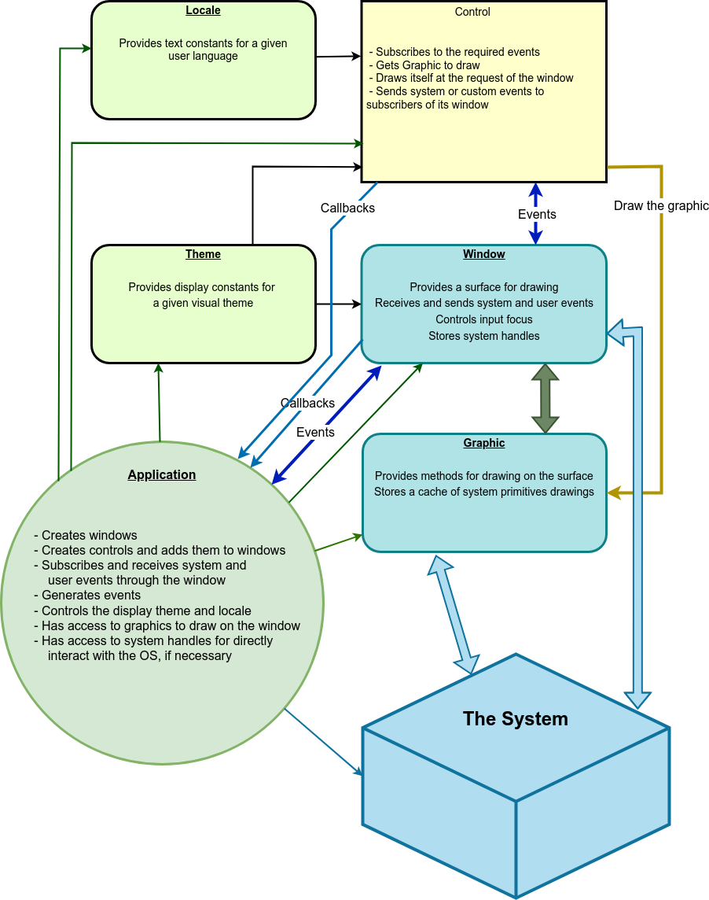
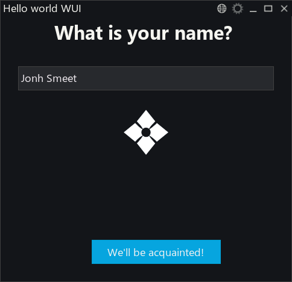
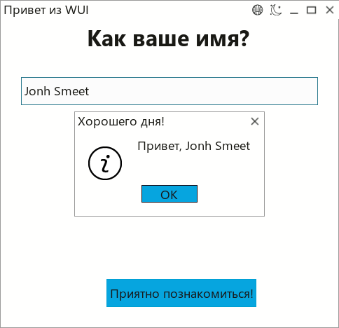

# WUI (Window User Interface Library)

WUI is a cross-platform modern C++ library for creating graphical user interfaces. The library uses C++17 and has a minimalistic API. Currently it supports Windows (XP - 11) and Linux (glibc 2.23 and above).

WUI is designed to provide developers with a simple and efficient tool for creating cross-platform GUI applications in C++. The library allows focusing on application logic rather than platform-specific interface implementation details.

## Features

- Cross-platform: supports Windows and Linux, with macOS planned
- Minimalistic API, ease of use
- Common interfaces for drawing and event handling, platform-independent
- Support for themes and localization
- Ability to create and integrate custom controls
- Application configuration management (Windows registry, ini files, JSON)

## Architecture

The project is based on three key entities:

- **Window** — a window that receives system events and manages controls
- **Control** — a visual interface element (buttons, input fields, etc.)
- **Graphic** — an interface for rendering, abstracting platform-dependent drawing methods



**Control** is any visual element for user interaction: button, input field, list, menu, etc. Control knows how to handle events coming from Window, stores its states, and draws itself on the graphical context provided by the containing window.

**Window** receives system events and provides their distribution to subscribers. The window also commands its controls to redraw and provides them with its graphic. In addition, the window controls the input focus, can make modality, and send an event to the subscribed user or to the system.

**Graphic** is the third base entity that provides an interface to system drawing methods. Currently, drawing is implemented on Windows GDI/GDI+ and Linux xcb/cairo.

The library also has auxiliary tools:
- **common** — basic types (`rect`, `color`, `font`)
- **event** — mouse, keyboard, internal and system events
- **theme** — constant system for visual themes support
- **locale** — subsystem for storing text content

## Platforms

Currently supported:

- **Windows** (WinAPI + GDI)
- **Linux** (X11 + xcb)

macOS support will be completed soon.

All platform-dependent code is collected in two elements — `window` and `graphic` (rendering subsystem).

## Fundamental Principles

The window receives system events: need to render, mouse and keyboard input, device changes, user messages. These messages are passed to window event subscribers — controls contained on the window and user code of the application.

Receiving events from a control is performed by callbacks specific to that control. This allowed us to simplify the event system without losing functionality.

When it is necessary to draw a part of the window, we search for controls falling into the redrawing area and call the `draw()` method of each control sequentially. Controls with `topmost() == true` are drawn last, to be at the top of the control stack.

### Flat Control Ownership Model

WUI uses a flat control ownership model: all window controls are owned by a single parent object (usually a dialog class), which stores them in `std::shared_ptr`. When the parent is destroyed, all controls are automatically released.

```cpp
class DialingDialog {
    std::shared_ptr<wui::window> window;
    std::shared_ptr<wui::text> text;
    std::shared_ptr<wui::image> image;
    std::shared_ptr<wui::button> cancelButton;
};
```

This approach provides:
- Simple memory management without manual deletion
- Predictable control lifecycle
- No circular references
- Safety through `std::shared_ptr`/`std::weak_ptr`

[More about flat control ownership](doc/en/docs/base/ownership.md)

### Flat Event Subscription Model

WUI implements a **"flat subscription"** model: the window acts as a central event dispatcher, and any object can subscribe to the events it needs.

```cpp
// Subscribe to keyboard and system events
std::string sub_id = window->subscribe(
    [this](const wui::event& ev) {
        if (ev.type & wui::event_type::keyboard) {
            // Hotkey logic
        }
    },
    wui::event_type::keyboard | wui::event_type::system
);

// Unsubscribe by ID
window->unsubscribe(sub_id);
```

Advantages:
- **Decoupling from hierarchy** — no need to inherit from controls to handle events
- **Flexibility** — any object can subscribe to events of any control
- **Lifetime management** — dynamic subscribe/unsubscribe via unique ID
- **Performance** — subscribers stored in `std::vector` for cache locality

[More about events](doc/en/docs/base/event.md)

## Documentation and Resources

- Documentation: [https://libwui.org/doc](https://libwui.org/doc)
- Website: [https://libwui.org](https://libwui.org)
- Telegram chat: [https://t.me/libwui_chat](https://t.me/libwui_chat)
- Email: [info@libwui.org](mailto:info@libwui.org)

## Examples




## Maintainer

The project is supported by the independent laboratory of deterministic synthesis [🌿 Intent-Garden](https://intent-garden.org).

🌿 [Intent-Garden](https://intent-garden.org) | 📜 [RuleROM](https://rulerom.com) | 🐉 [Decima8](https://decima8.org) | 🎨 [libwui](https://libwui.org)
