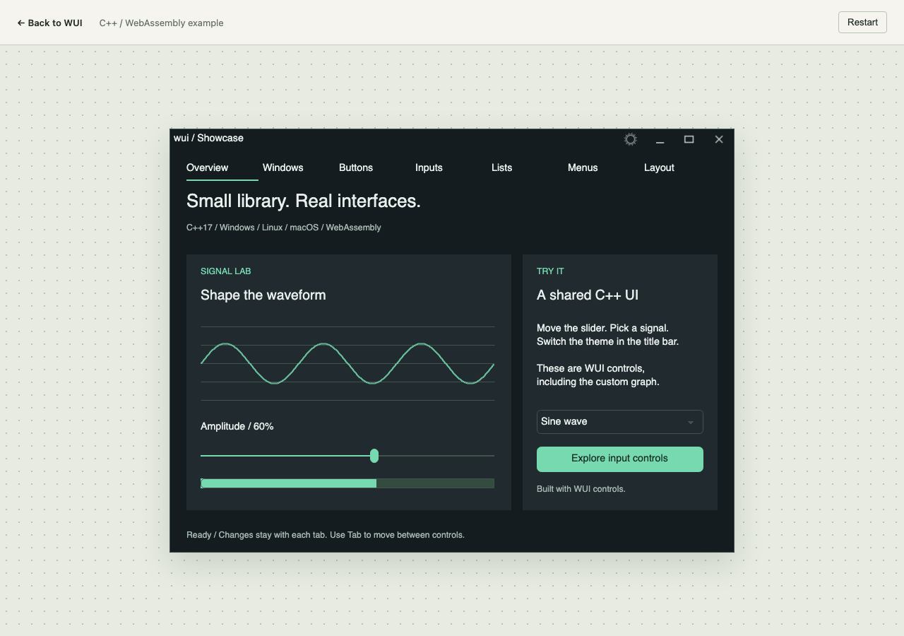

# WUI три года спустя: C++-интерфейс на Windows, Linux, macOS и в браузере

В октябре 2023 года я [рассказывал на Хабре](https://habr.com/ru/articles/768336/) о WUI — небольшой UI-библиотеке на C++, которую начал делать для своего приложения. Тогда она работала на Windows и Linux, а macOS оставалась в списке задач.

Теперь у WUI есть бэкенды для macOS и WebAssembly. Можно открыть сайт и пощелкать тот же интерфейс, который собирается в desktop-приложение: кнопки, многострочный ввод, списки, меню, диалоги, разделители. Код контролов и логика демонстрации общие.

[Запустить Showcase в браузере](https://libwui.org/wasm/demo/) · [GitHub](https://github.com/intent-garden/wui) · [Документация](https://libwui.org/doc_ru/)



В этой статье — о том, как устроены новые порты, какие мелочи оказались важнее первого появившегося окна и куда я хочу развивать библиотеку.

## Зачем мне до сих пор своя UI-библиотека

WUI появилась из потребностей VideoGrace. Хотелось поддерживать один интерфейс приложения на нескольких платформах и иметь возможность самостоятельно рисовать контролы. Эта задача по-прежнему определяет устройство библиотеки.

Когда-то была даже идея сделать что-то вроде boost.ui. Отсюда интерес к небольшому C++ API, коллбэкам и возможности подключить UI к уже существующему приложению. WUI распространяется под Boost Software License 1.0; полный Boost для её использования не требуется.

Сегодня WUI — компилируемая библиотека на C++17. В ней есть окна, контролы, рисование, события, темы, локализация и вспомогательные средства для настроек. Прикладные задачи — работа с сервером, базой данных или медиапотоком — остаются в приложении.

Мне интересна ниша небольших desktop-инструментов: клиентские приложения, панели управления, редакторы, инженерные утилиты. Особенно когда основная логика уже написана на C++, а интерфейс хочется собирать рядом с ней на том же языке.

## Общие контролы, разные платформенные реализации

Основа WUI — окно, контрол и графический контекст.

Окно принимает события платформы, управляет фокусом и вызывает отрисовку. Контрол хранит своё состояние, обрабатывает события и рисует себя через `graphic`. Платформенная реализация отвечает за то, как конкретно открыть окно, получить ввод или вывести изображение.

Сейчас это выглядит так:

| Платформа | Окна и события | Рисование |
| --- | --- | --- |
| Windows | Win32 | GDI/GDI+ |
| Linux | X11/XCB | Cairo |
| macOS | AppKit | Core Graphics, Core Text |
| Браузер | DOM-события, связующий JavaScript-код | Canvas 2D |

Кнопка при этом остаётся одной C++-реализацией. У неё общий код состояний, обработки нажатия и выбора цветов из темы. То же относится к полям ввода, спискам и остальным общим контролам.

Такое разделение оказалось полезно при переносе. Добавляешь платформенную реализацию, после чего можешь сразу проверять существующий интерфейс целиком. Исправление общей логики выделения текста затем попадает во все сборки.

Это также определяет внешний вид: WUI рисует собственные контролы. Метрики шрифтов и некоторые детали отображения зависят от платформы, поэтому обещать попиксельное совпадение было бы неправильно. Общими остаются структура интерфейса, темы и код взаимодействия.

## macOS: окно — только начало

На Mac используется AppKit для окон и событий, Core Graphics для рисования, Core Text для текста и ImageIO для изображений. X11 и Cairo здесь не нужны. Objective-C++ находится внутри платформенной реализации; в пользовательских C++-заголовках его нет.

Для сборки примеров нужны Xcode Command Line Tools и CMake:

```sh
cmake -S . -B build-macos -DCMAKE_BUILD_TYPE=Release
cmake --build build-macos --parallel
open build-macos/examples/demo/demo.app
```

Ресурсы попадают в пакет приложения, в `Contents/Resources/res`. Это существенно для запуска через Finder: рассчитывать на рабочий каталог, из которого случайно запускали программу при разработке, нельзя.

После появления первого окна начинается менее эффектная часть переноса:

- учитывать Retina при создании буферов и изменении масштаба;
- согласовать размеры текста с координатами контролов;
- передавать ввод, выделение и композицию IME;
- поддержать привычные Cmd+A/C/X/V;
- разобраться с фокусом, модальными окнами и завершением цикла событий.

Например, в AppKit интерфейс должен обслуживаться главным потоком. Из рабочего потока приложение может отправить `window::emit_event()`, а обновление контролов выполнить при обработке события. Таймеры macOS-бэкенда тоже вызывают коллбэки в главном потоке.

Порт проверялся на Apple Silicon. Минимальная версия в настройках сборки — macOS 10.15; это параметр deployment target, а не результат проверки на каждой версии системы.

## WebAssembly: сохранить привычное C++-приложение

Следующим шагом стал браузер. Здесь WUI собирается через Emscripten, а графические операции выполняются через Canvas 2D. Каждое отдельное окно получает свою область Canvas внутри страницы.

Контролы и логика приложения остаются на C++. JavaScript связывает их с браузерными событиями, рисованием, загрузкой изображений и вводом текста. Для композиции IME используется вспомогательный `textarea`.

Один из важных вопросов — время жизни приложения. Desktop-код привык к такой последовательности:

```cpp
wui::framework::init();
// Создать окно и контролы.
wui::framework::run();
// Освободить объекты после завершения работы.
```

Браузеру нужно регулярно возвращать управление, иначе он не сможет обрабатывать события и рисовать страницу. В текущем порте этот контракт сохраняется через Asyncify: C++-стек приложения остаётся жив, а браузер получает возможность продолжать работу. `run()` возвращается после `stop()`.

У решения есть цена в размере и накладных расходах исполнения. Для первого браузерного бэкенда приоритетом стала совместимость с существующими примерами, в том числе с объектами главного окна на стеке.

Отрисовка запрашивается через `requestAnimationFrame` при изменениях интерфейса. Размеры задаются в CSS-пикселях, а буферы учитывают `devicePixelRatio`.

После установки и активации Emscripten примеры собираются так:

```sh
emcmake cmake -S . -B build-wasm-release -DCMAKE_BUILD_TYPE=Release
cmake --build build-wasm-release --target wui_web_site --parallel
python3 -m http.server 8080 --directory build-wasm-release/site
```

Полученный каталог можно разместить на статическом хостинге. Для самого UI серверная часть не нужна. На сайте WUI именно так и размещены три работающих примера.

## Showcase, в которой есть что нажимать

Старую демонстрацию хотелось превратить в место, где библиотеку можно оценить за пару минут. Сейчас в Showcase семь страниц:

| Страница | Что можно попробовать |
| --- | --- |
| Overview | Пользовательское рисование, выбор формы сигнала, слайдер и связанный индикатор |
| Windows | Диалоги с результатами и отдельное окно с редактируемым текстом |
| Buttons | Девять вариантов кнопок, счётчики нажатий, toggle, checkbox и radio |
| Inputs | Однострочный и многострочный ввод, пароль, read-only и фильтры символов |
| Lists | 120 демонстрационных строк, поиск, фильтрацию, выбор и прокрутку |
| Menus | Вложенные меню, разделители, недоступные действия и подсказки |
| Layout | Изменяемое разделение области, слайдер, индикатор и отдельный скроллбар |

Можно переключить светлую и тёмную тему. Переходы между страницами сохраняют введённый текст, выбранные значения и положение разделителя.

Данные в списках и действия меню демонстрационные. Зато взаимодействие настоящее: поле редактирует текст, фильтр меняет список, диалог возвращает выбранный результат.

## Маленькие контролы, много состояний

Хороший пример последних изменений — переключатели. Раньше их внешний вид зависел от подготовленных картинок. Теперь toggle, radio и классический checkbox рисуются примитивами: форма, заливка, рамка, отметка.

Они используют цвета темы и учитывают состояния фокуса и недоступности. Для выбора представления достаточно параметра конструктора:

```cpp
auto check = std::make_shared<wui::button>(
    "Enable notifications",
    [] { /* Реакция приложения на изменение. */ },
    wui::button_view::checkbox);

window->add_control(check, {20, 60, 280, 100});
check->turn(true);
```

Здесь `window` — уже созданное окно с настроенной темой. Координаты контрола — `{left, top, right, bottom}`. При пользовательском переключении состояние меняется до вызова коллбэка; программный `turn()` коллбэк не вызывает.

Ещё больше внимания потребовал текстовый ввод. Нарисовать курсор относительно просто. Дальше появляются выделение через несколько строк, замена выделенного текста, переходы по границам строк, мышь, клавиатура, прокрутка и UTF-8.

Поэтому в проверках важны последовательности действий. Ввести текст, выделить часть, заменить её, перейти на другую страницу и вернуться — гораздо полезнее, чем убедиться, что поле появилось на скриншоте.

Для macOS есть интеграционные тесты с настоящими окнами. Для WASM используются Playwright и Chromium, Firefox, WebKit. Проверяются ввод, фокус, диалоги, темы, события, таймеры и сценарии Showcase. WebKit здесь означает движок из Playwright, а не установленное приложение Safari.

## Где ещё предстоит работа

Браузер добавляет собственные условия. Доступ к clipboard связан с действиями пользователя; вставка через Ctrl/Cmd+V и синхронное чтение буфера из C++ имеют разную семантику. Файлы и INI-настройки текущего WASM-бэкенда живут в памяти и сбрасываются после перезагрузки страницы. Worker-интеграции пока нет.

Отдельная большая задача — доступность. Нарисованным на Canvas контролам нужно полноценное семантическое представление для вспомогательных технологий. Аналогичная работа нужна и собственным desktop-контролам.

Системные возможности тоже различаются: у браузерного окна нет desktop-tray, а в macOS остаются задачи по горизонтальной прокрутке трекпадом и уведомлениям о подключении устройств. Подробности собраны в руководствах по [macOS](https://libwui.org/doc_ru/howto/macos/) и [WASM](https://libwui.org/doc_ru/howto/wasm/).

## Куда дальше

Следующий шаг для меня — примеры, которые показывают подключение UI к полезной работе:

- SQLite: таблица записей, поиск, редактирование и сохранение;
- сеть: запрос к серверу, состояния загрузки и ошибки, отмена операции;
- медиа: изображение или видеокадр, управление воспроизведением;
- IM: список диалогов, история сообщений и поле ввода.

Это планы развития примеров. Они помогут проверить, удобно ли связывать контролы с данными, обновлять UI из результатов фоновой работы и управлять временем жизни объектов.

Вместе с этим хочется улучшать ввод, доступность, компоновку и документацию. Для браузера — добавить постоянное хранение данных и понятный путь работы с пользовательскими файлами.

Я вижу место для WUI рядом с большими UI-фреймворками: когда нужны собственный внешний вид, C++ API и достаточно небольшой набор UI-возможностей. Следующая полезная проверка — приложения других разработчиков, с их данными, сценариями и требованиями.

[Исходники WUI](https://github.com/intent-garden/wui), [живая демонстрация](https://libwui.org/wasm/demo/) и [документация](https://libwui.org/doc_ru/) открыты. Буду рад конкретным сценариям: какой инструмент вы бы попробовали на ней собрать и чего для этого не хватает?
