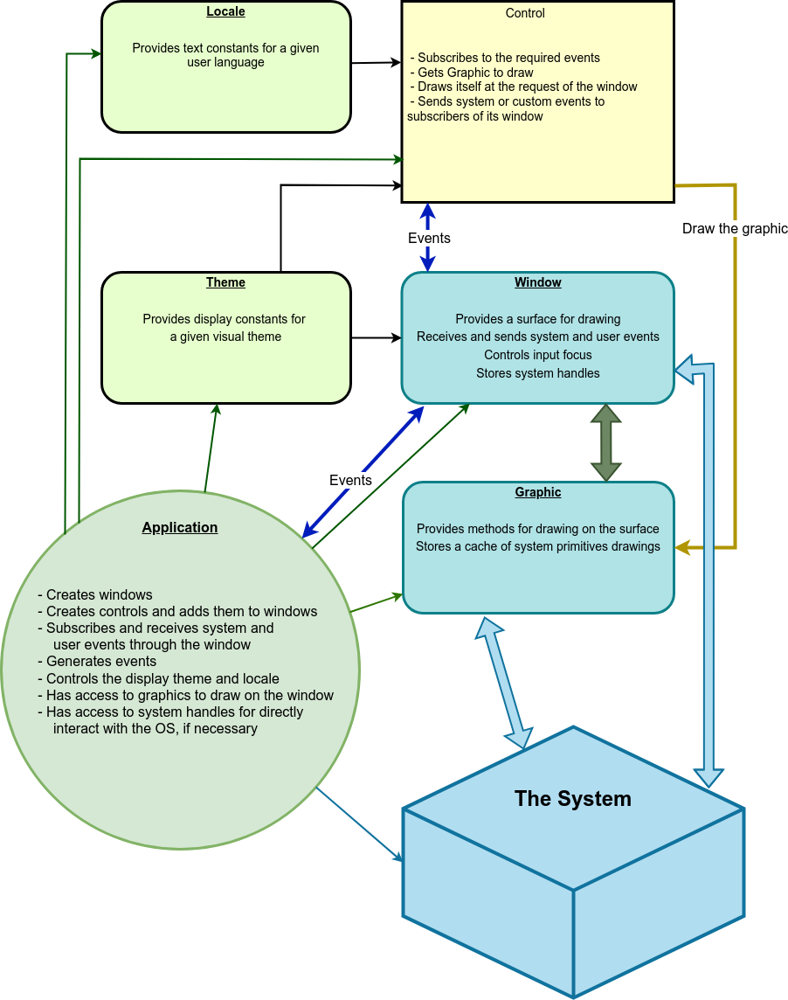
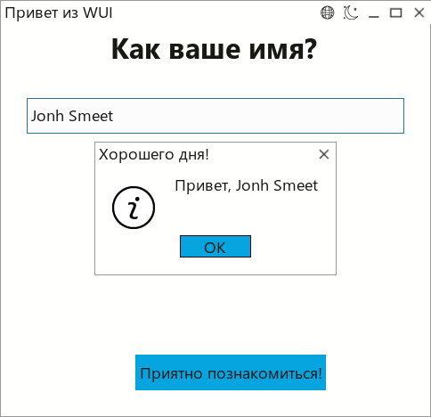
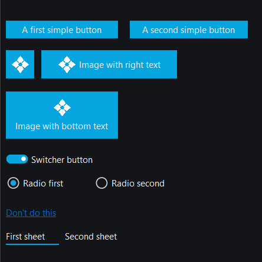
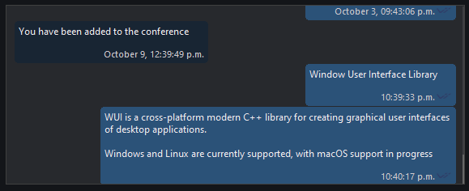
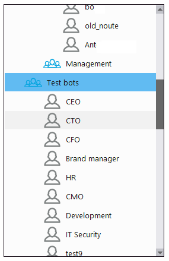
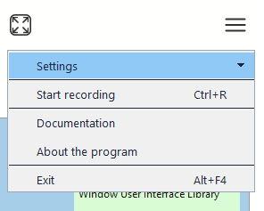
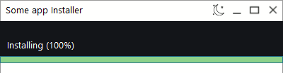

## Intro

It started almost two years ago in December, our main project (video messenger) was using WTL for Windows and GTKmm for Linux. There was no mac support. It was a huge hassle to lug around two identical clients that are supposed to do everything strictly the same. Of course, this never worked out. The thought of making one more native client for mac gave me a nervous tic....

On a reasonable question - why it was not done on Qt at once I can only answer that it is connected with, so to say, gourmet preferences and, partly, with love to monolithic exe. And I didn't need anything but vinda at the start.

During six years of living with two code bases of the same thing, we slowly picked up lightweight UI libraries written at least in C++17 style.

I must say that we actively use boost and love it as much as we can with all our souls...

In 2021, apparently Google was not working well or the stars were aligned, but nothing worthwhile was found. All I could find were html projects based on rendering and wrapping over wxWidgets. Now we know about lvgl, yes... But in general, there are thousands of them.

wxWidgets is not bad, but I wanted my own drawing, without boxes for buttons, input fields and lists, boost/bsd similar license, as concise as possible, and ideally working from Windows XP / CentOS 6 on standard GDI / X11 to Vulkan on modern machines.

In the end, it was decided to make a minimal UI framework for this project, and immediately release it in Open Source under the boost license.

## Tasks for the UI framework

- Run on Windows (At least 7, but works on XP)
- Run on Linux (Starting with Ubuntu 16 / CentOS6)
- Run on macOS
- Open windows and display controls on them.
- Provide a common interface to the drawing subsystem that hides platform-dependent methods. This will allow you to write a control once, on any platform, and it will look and behave the same on all.
- Provide a common interface to events. Any control or user can subscribe to any message group, including custom ones, with the ability to send/receive messages asynchronously.
- Receive system messages, respond to mouse, keyboard and other events.
- Have the ability to change the color scheme / style / icons / images of all controls / windows from one place. Store all visual settings of the application in json, including having the ability to store images in it as well.
- Provide a system of text constants for titles and labels depending on the language selected.
- Have the ability to detach / attach windows from each other.
- Provide an implementation of basic UI controls and have a clear and accessible way for third party developers to add new controls for their applications.
- Have a user-friendly interface for working with application configs. Windows registry and ini files are supported. Naturally, with the possibility of modification.

## General scheme of the framework

Everything is based on two entities - Window and Control. A window can contain controls, and the window itself is a control.

Control is any visual element for user interaction - a button, an input field, a list, a menu, etc. Control knows how to handle events coming from Window, stores its states and draws itself on the graphical context provided by the window containing it.

Window - receives system events and provides their distribution to subscribers. The window also commands its controls to redraw themselves and provides them with their own graphics. In addition, the window controls the input focus, can make modality and send an event to the subscribed user or to the system.

Graphic - provides an interface to the system's drawing methods. Currently, drawing on Windows GDI/GDI+ and Linux xcb/cairo is implemented. Of course, there is no obstacle to implementing drawing on vulcan/bare metal/etc.

The library also has auxiliary tools for work - structures common (contains such basic types as rect, color, font), event (mouse, keyboard, internal and system events), graphic (for physical drawing on system graphic context) theme (system of constants for convenient support of visual themes) , locale (subsystem for convenient storage of text content), config (for convenient, uniform work with application settings).

## Some fundamental principles

In general, the process of application operation looks as follows:

The window receives system events such as: the need to draw, mouse and keyboard input, device changes, and user messages. These messages are passed to the subscribers of window events, these are, firstly, the controls contained on the window, and secondly, the user code of the application, if necessary. To simplify the work, it is possible to receive only events related to the control: mouse - in the rectangle occupied by the control; keyboard - if the input focus belongs to the control.

Receiving messages/events from a control is performed by callbacks specific for this control. This allowed us to radically simplify the event system without losing functionality and, in our opinion, winning in brevity.

When it is necessary to draw a part of the window, we search for controls falling into the redrawing area and call the draw() method of each control sequentially, according to the order in which the controls are added to the window. Controls responding to the topmost() true are drawn last, to be at the top of the control stack.

To make it a little clearer how the system is built, we suggest to consider the interfaces of window, control and graphic.

### Window methods

Creating / destroying a window

    bool init(const std::string &caption, const rect &position, window_style style, std::function<void(void)> close_callback);
    void destroy();

Redraws a part of the window with the controls present in this area. This method is called by a control when it needs to redraw itself. In response, the window calls draw() of the control with the prepared graphic (drawing context).

    void redraw(const rect &position, bool clear = false);

Methods for subscribing to events that the window receives. Events can be from the system, internal or from the application.

    std::string subscribe(std::function<void(const event&)> receive_callback, event_type event_types, std::shared_ptr<i_control> control = nullptr);
    void unsubscribe(const std::string &subscriber_id);

When subscribing, the types of events to be received are specified and a token is returned to the subscriber, which can be passed to unsubscribe() for forced unsubscribing.

Send a message via the system message broker (Win32 / X11)

    void emit_event(int32_t x, int32_t y);

A reference to a structure containing platform-dependent entities. For example HWND window descriptor in Windows or xcb_connection / Display in Linux.
    
    system_context &context();

### Control methods

Each control must implement at least these methods. Also the window, being a control itself, must implement them.

Method where the control must draw itself. Called only by the window when the control needs to redraw itself. If the control needs to redraw itself, it must call redraw() of its parent window.void draw(graphic &gr, const rect &paint_rect);

Custom method for changing the position of the control on the window. The coordinates are specified in pixels relative to the top left corner of the parent window.

    void set_position(const rect &position, bool redraw = true);

User-defined method, returns the position of the control relative to the windowrect position() const;

The method called by the parent window when add_control() is called, allows the control to get a pointer to its parent window.

    void set_parent(std::shared_ptr<window> window_);

Returns a pointer to its parent window

    std::weak_ptr<window> parent() const;

The method called by parent window when remove_control() is called clears the pointer to the control's parent window

    void clear_parent();

Tells the parent window whether the control should be drawn on top of all other controls

    bool topmost() const;

Changes the visual theme of the control. If the parameter is nullptr, the default application theme is used.

    void update_theme(std::shared_ptr<i_theme> theme_ = nullptr);

Visibility control methods

    void show();
    void hide();
    bool show() const;

Methods of "enablement" control
    
    virtual void enable();
    void disable();
    bool enabled() const;

Methods for building a relationship between the control and the keyboard input focus

    bool focused() const; /// Returns true if the control is focused
    bool focus() const; /// Returns true if the control receives focus

Returns a structure containing details of the last error. Should be called after the control has been constructed, or if the control contains methods of type bool init() implying external problems.
    
    error get_error() const;

### Graphic methods

Each window has its own graphic for drawing its controls. But nobody prevents you from creating your own additional graphic inside the control or from within the application. To draw a control, the window provides a reference to its graphic through a call to the control's draw() method.

    graphic(system_context &context);

Initialization/deinitialization methods

    void init(const rect &max_size, color background_color);void release();

Sets the background color, this color will be used to fill the canvas when clear() is called.
    
    void set_background_color(color background_color);
    void clear(const rect &position);

Resetting (drawing) the area to the system graphic context

    void flush(const rect &updated_size);

Draw a point, line

    void draw_pixel(const rect &position, color color_);
    void draw_line(const rect &position, color color_, uint32_t width = 1);

Measure the size of the text with the selected font
    
    rect measure_text(const std::string &text, const font &font_);

Write the text with the selected font
    
    void draw_text(const rect &position, const std::string &text, color color_, const font &font_);

Draw a simple rectangle

    void draw_rect(const rect &position, color fill_color);

Draw a rectangle with rounded edges
    
    void draw_rect(const rect &position, color border_color, color fill_color, uint32_t border_width, uint32_t round);

Draw RGB32 buffer
    
    void draw_buffer(const rect &position, uint8_t *buffer, size_t buffer_size);

Draw the contents of another graphic
    
    void draw_graphic(const rect &position, graphic &graphic_, int32_t left_shift, int32_t right_shift);

Access to system DC

    #ifdef _WIN32
    HDC drawable();
    #elif
    linuxxcb_drawable_t drawable();
    #endif

The list of drawing methods can and will be expanded as needed.

## Main application loop

In the case of running on Windows, a standard infinite loop is run:

    MSG msg;
    while (GetMessage(&msg, nullptr, 0, 0))
    {
        TranslateMessage(&msg);
        DispatchMessage(&msg);
    }

Each running, non-child window becomes a message recipient via its wnd_proc. Then, depending on the type of event, either controls are redrawn, window position/size is handled, or the event is sent to subscribers. The lifetime of the first window created determines the lifetime of the application.
On linux the picture is slightly different, but it looks similar for the user and controls. Each non-child window, runs a separate thread to wait for events in xcb_wait_for_event() and send them out to subscribers as they arrive.

    bool window::init(...)
    {
        ...
        thread = std::thread(std::bind(&window::process_events, this));
    }

    void window::process_events()
    {
        xcb_generic_event_t *e = nullptr;
        while (runned && (e = xcb_wait_for_event(context_.connection)))
        {
            switch (e->response_type & ~0x80)
            {
                case XCB_EXPOSE:
                ...

All this code is hidden in window and framework.
framework has only 3 main functions init(), run() and stop(). init() should be called in the first line of main(), run() after window->init(...), and stop() when it is necessary to terminate the process (for example, the user pressed "cross").

    int main(..)
    {
        wui::framework::init();
        
        MainFrame mainFrame;
        mainFrame.Run();
        
        wui::framework::run();
        return 0;
    }

Here wui::framework::end(); is called in the callback of closing the main window:

    void MainFrame::Run()
    {
        window->init(wui::locale("main_frame", "caption"),
            { -1, -1, width, height },
            wui::window_style::frame, [this]() {
                wui::framework::stop();
            });
    }

## Transitivity

Applications are not conceivable without modal dialogs. To implement them, a window has a method:

    void set_transient_for(std::shared_ptr<window> window_, bool docked = true);

With this method, the parent window is told that another window should be made modal relative to it. The docked flag indicates that the modal window should be displayed in the base window, without creating a physical system window. If the modal window is larger than the parent window, this flag is ignored and a new system window is created.
Strictly speaking, there is no modality in the usual WinAPI sense in the library. That is, the init() call of a transient window does not block the calling code, but it is bypassed by continuing the logic in the close_callback callback passed to init().
As practice has shown, it is quite possible to live with it, and for some things it even turns out to be more convenient.

## Resources

The theme and locale subsystems are implemented for convenient and uniform display of many controllers and inscriptions of the application, for convenience of work of non-programmers, for example, designers, translators.

The application always has a current theme and locale. These are essentially configs that give values for a pair of section + key. A theme is passed to each control (and window, since it is also a control) to give that control values for its colors, sizes, thicknesses, fonts, and so on. By default, you may not pass a custom theme to a control, then it will use the common current theme of the application.

The custom code to generate the labels has access to the current application locale. This allows all text resources to be collected in one place and also, in one place, changed for the entire application.

The application has the ability to change the current theme and locale, which causes an automatic change in the appearance of controls and windows / language of the entire application.

Technically the subsystems are implemented similarly, let's take theme as an example

The theme is a json containing parameter values for controls, for example for window and caption and images.

dark.json:

    {
        "controls": [
        {
            "type": "window",
            "background": "#131519",
            "border": "#404040",
            "border_width": 1,
            "text": "#f5f5f0",
            "active_button": "#3b3d41",
            "caption_font": {
                "name": "Segoe UI",
                "size": 18,
                "decorations": "normal"
            }
        }, 
        {
            "type": "text",
            "color": "#f5f5f0",
            "font": {
                "name": "Segoe UI",
                "size": 18
        },
        {
            "type": "image",
            "resource": "IMAGES_DARK",
            "path": "~/.hello_wui/res/images/dark"
        }
        ...
    }

light.json:

    {
        "controls": [
        {
            "type": "window",
            "background": "#fffffe",
            "border": "#9a9a9a",
            "border_width": 1,
            "text": "#191914",
            "caption_font": {
                "name": "Segoe UI",
                "size": 18
        },
        {
            "type": "text",
            "color": "#191914",
            "font": {
                "name": "Segoe UI",
                "size": 18
            }
        },
        {
            "type": "image",
            "resource": "IMAGES_LIGHT",
            "path": "~/.hello_wui/res/images/light"
        }
        ...
    }

This approach provides the application and controls with a transparent, centralized mechanism for controlling the display. If you need to create a custom control (e.g. a red button), you can simply add a new section to the json:

    {
        "type": "red_button",
        "calm": "#c61818",
        "active": "#e31010",
        "border": "#c90000",
        "border_width": 1,
        "focused_border": "#dcd2dc",
        "text": "#f0f1f1",
        "disabled": "#a5a5a0",
        "round": 0,
        "focusing": 1,
        "font": {
            "name": "Segoe UI",
            "size": 18
        }
    }

And when creating a control, specify the name of the control: "red_button", for example:

    cancelButton(new wui::button(wui::locale("button", "cancel"), this { window->destroy(); }, "red_button"))

The image controller is used to work with icons and similar images. It also uses theme to get the win32 resource identifier or path to the image file. This allows you to create an image

    logoImage(new wui::image(IMG_LOGO)) 

Where:

    #ifdef _WIN32
    #define IMG_LOGO 4010
    #else
    static constexpr const char* IMG_LOGO = "logo.png";
    #endif

The logo will be loaded according to the given theme.

## Multithreading issues

WUI does not use a single mutex. Control callbacks and system events come only from a single thread on Windows (proc_wnd) or from a window thread waiting for xcb_wait_for_event().

It is recommended to perform all UI manipulations either in callbacks / received system events, or in one special UI track of the application.

If you plan to window.add_control() / window.remove_control() from different tracks, it is necessary to implement protection at the application code level.

## Unicode

Only UTF-8 passed in regular std::string / char * is used. 

To interact with WinAPI which needs utf16 in wchar, boost::nowide::widen() / boost::nowide::narrow() is used. boost::nowide has no dependencies on boost and comes with the WUI in thirdparty. Thus, if your project does not have boost you do not have to include it in the dependencies for the WUI. 

The application should also use boost::nowide to run WUI together with WinAPI.

More information on why wchar is not needed is here: https://utf8everywhere.org/.

On Linux boost::nowide is not required and dependencies on it are excluded.

## Error handling

WUI does not use exceptions. Methods that may terminate with an error return a bool. To get details about the problem, the get_error() method returns the structure

    struct error
    {    
        error_type type;    
        std::string component, message;    
        bool is_ok() const;
    };

Errors that may have occurred in the object constructor should be checked like this:

    newObject(new wui::image(IMG_LOGO)).....
    if (!newObject->get_error().is_ok()) { log("error", newObject->get_error().str()); }

## Hello world app

As a basis for any project using WUI, a minimal application is offered, which, however, is immediately made for the possibility of its extension to a large project. 
This application is located in examples/hello_world and includes all necessary resource files. On Windows the application is assembled into a monolithic exe, on Linux/Mac it stores resources in the "res/" folder next to the executable. For real applications it is better to specify the paths "~/.app_name/res" or, if the application is installed from root, something like "/opt/app_name/res" .
Shows the use of theme, locale and config, in an application that has two color schemes (dark and light), two languages and stores its configuration in the registry on Windows and ini file on Linux.

[main.cpp](https://github.com/ud84/wui/blob/main/examples/hello_world/hw.cpp)

The demo application shows the logo, displays a caption and provides an input field. When the button is clicked, a message box is displayed and the application is closed. It also shows tracking of the user closing the window and displaying a confirmation message.

In the following screenshot, the theme is changed to light, the language to Russian and the "Nice to meet you" button is pressed

[MainFrame.h](https://github.com/ud84/wui/blob/main/examples/hello_world/MainFrame/MainFrame.h)
[MainFrame.cpp](https://github.com/ud84/wui/blob/main/examples/hello_world/MainFrame/MainFrame.cpp)

The window and controls are created in the MainFrame constructor. The application subscribes to events and adds controls to the window. Controls' callbacks are handled with the help of lambdas for the sake of brevity. 

The Run() method starts the window and contains a lambda that handles callbacks from window controls (language and theme buttons).

ReceiveEvents() receives events from the window and is used to respond to window resizing by calling UpdateControlsPosition(). which recalculates the new coordinates of the controls.

## Controls

At the time of writing, 14 controls have been implemented as part of the WUI and several specific ones as part of our application. The list of available controls:

### button

A button can be of the following types:
    
    text
    image
    image_right_text
    image_bottom_text
    switcher
    radio
    anchor
    sheet

### image

image is needed to display icons in a uniform way, taking into account the visual theme. For example button uses image to draw icons on itself. image draws itself from a resource that matches the visual theme.

An example of using image:

Create in the constructor of the containing image class

    auto logoImage = std::make_shared<wui::image>(IMG_LOGO);

IMG_LOGO is defined in the application's resourse.h as follows:

    #ifdef _WIN32
    #define IMG_LOGO 109
    #else
    static constexpr const char* IMG_LOGO = "logo.png";
    #endif

Thus, the image will be taken from the exe resource on Windows or from a file on other systems.
The magic of changing the image when changing the theme is realized as follows. image has its own settings in theme:

light.json:

    {
        "type": "image",
        "resource": "IMAGES_LIGHT",
        "path": "res/images/light"
    }

dark.json:
    
    {
        "type": "image",
        "resource": "IMAGES_DARK",
        "path": "res/images/dark"
    }

The path to the resource file is made up of the path specified in theme and the file name in image, which leads to automatic replacement of all application images when the theme is changed.

On Windows it is worth mentioning how the rc file of the application is organized.

    IMG_LOGO IMAGES_DARK "res\images\dark\logo.png"
    IMG_LOGO IMAGES_LIGHT "res\images\light\logo.png"

Thus, replacing the IMAGES_DARK / IMAGES_LIGHT group causes the same effect as with files, without having to change the resource ID.

### input

This control implements a standard input field. Since the implementation is custom, at the moment there is no Undo / Redo, but in the future there should be spell checking, hints, validation.

### list

Vertical list of items with scrolling. Items are rendered by custom code via callback. It is possible to create items with different heights. It can be used to make a chat room, a table to the database, basically any list.

A chatroom example

User's list example

### menu

Menus are ribbon menus, with no side branches. Attachments expand downward, lengthening the menu.

The menu is set in a declarative style, vector, internally done on a list

    menu->set_items({
            { 0, wui::menu_item_state::separator, "Bla bla bla", "", menuImage1, {},  {} },
            { 1, wui::menu_item_state::normal, "Expand me 1", "", nullptr, {
                    { 11, wui::menu_item_state::normal, "Expanded 1.1", "", nullptr, {},  {} },
                    { 12, wui::menu_item_state::normal, "Expanded 1.2", "", nullptr, {
                            { 121, wui::menu_item_state::normal, "Expanded 1.1.1", "", nullptr, {},  {} },
                            { 122, wui::menu_item_state::normal, "Expanded 1.1.2", "Shift+Del", menuImage2, {},  {} },
                            { 123, wui::menu_item_state::separator, "Expanded 1.1.3", "", nullptr, {},  {} },
                        },  {} },
                    { 13, wui::menu_item_state::normal, "Expanded 1.3", "", nullptr, {},  {} },
                },  {} },
            { 2, wui::menu_item_state::separator, "Expand me 2", "Ctrl+Z", nullptr, {
                    { 21, wui::menu_item_state::normal, "Expanded 2.1", "", nullptr, {},  {} },
                    { 22, wui::menu_item_state::normal, "Expanded 2.2", "", nullptr, {},  {} },
                    { 23, wui::menu_item_state::separator, "Expanded 2.3", "", nullptr, {},  {} },
                },  {} },
            { 3, wui::menu_item_state::normal, "Exit", "Alt+F4", nullptr, {}, [&window](int32_t i) { window->destroy(); } }
        });

### message

It has standard sets of buttons and icons presented in the enumerations message_icon, message_button and message_result. When using it, there is one peculiarity that will seem unusual at first, namely, the call to message::show() does not block the calling thread. Therefore, getting the ID of the pressed button is done in a callback.

Example:
    
    messageBox->show(“message”, "header", wui::message_icon::information,
    wui::message_button::yes_no, [this](wui::message_result result) {
        if (result == wui::message_result::yes)
        {
            /// We continue here
        }
    });

### panel

A simple control to draw a rectangle of theme color on a window.

### progress

A simple progress bar

### select

A drop-down list, aka combo box. It has no editor, i.e. it works only for selecting from the available ones. It is also implemented on list.

### slider
Aka "volume control". Like progress can be horizontal and vertical.

Here text, slider and button

### splitter

Used to resize internal windows or panels.

### text

Text string. Allows you to set the text alignment and put a full stop if the text does not fit in the area.

### tooltip

### trayicon

Allows you to control the tray icon and inform the user with placeholders.

## Dependencies

WUI uses three libraries in the thirdparty. These are: boost::nowide, nlohman::json and utf8 by Nemanja Trifunovic. The last two are header only and are not troublesome. boost::widen comes as a "cut" from boost, there are builds on vs 2017, 2019 and 2022 version of boost: 1.83. If your project already uses boost (especially a different version), it is better to specify for wui the path to your boost.

External dependencies are not available on Windows. On Linux, xcb and cairo are currently required to work.

## Conclusion

The library as part of our application has been tested on several large industrial and medical enterprises. Various versions of Windows from XP to 11 and Linux from CentOS 6 to Ubuntu 22 were used.

In terms of reliability and performance the system shows very good results (no crashes, artifacts, memory leaks), which confirmed the acceptability of the adopted concepts.

The main directions of the project development are, of course, macOS support and adding new controls. For example, we need a calendar, multiline text editor, grid for database, charts and so on. Need a graphical editor to create at least dialogs. I also really want to replace X11 with Wayland and make graphics on Vulkan.

We will be grateful for constructive criticism, help in developing the project with ideas, code, distribution.

Thanks for your interest!

[Reddit community](https://www.reddit.com/r/wui/)

[Project site](https://libwui.org/)
