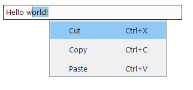

# Input

The `input` control provides a text input field with support for various modes.

## Quick Start

```cpp
#include <wui/control/input.hpp>

// Simple single-line input
auto name_input = std::make_shared<wui::input>("Enter name");
window->add_control(name_input, {10, 10, 200, 30});

// Multi-line input
auto memo = std::make_shared<wui::input>(
    "", 
    wui::input_view::multiline
);
window->add_control(memo, {10, 50, 300, 150});

// Password field
auto password = std::make_shared<wui::input>(
    "", 
    wui::input_view::password
);
window->add_control(password, {10, 100, 200, 130});
```

## Input Views

```cpp
enum class input_view
{
    singleline,   // Single line
    multiline,    // Multi-line
    readonly,     // Read-only
    password      // Password (characters hidden)
};
```

## Content Types

```cpp
enum class input_content
{
    text,       // Plain text
    integer,    // Integer numbers
    numeric,    // Floating point numbers
    hostport,   // Host:port
    hexadecimal // 0-9, A-F, a-f
};
```



## Editing behavior

- Text is UTF-8; cursor movement and limits count code points rather than bytes.
- Multiline input supports selections across empty lines, Shift+arrows and drag autoscroll.
- `symbols_limit = -1` removes the limit; the default is 10000. Paste replaces a selection before checking the resulting length.
- Single-line fields convert pasted line breaks to spaces. Password masks represent code points.
- `integer`, `numeric`, `hostport` and `hexadecimal` filter input characters; they are not complete validators for numbers, host names or ports.
- Read-only fields allow selection/copy, but prevent editing. Enter in multiline input edits text; `set_return_callback()` handles submission in applicable single-line modes.
- Browser clipboard behavior has [platform limits](../howto/wasm.md#capabilities-and-limits).

## API

### Constructor

```cpp
input(std::string_view text = "",
      input_view input_view_ = input_view::singleline,
      input_content input_content_ = input_content::text,
      int32_t symbols_limit = 10000,
      std::string_view theme_control_name = tc,
      std::shared_ptr<i_theme> theme_ = nullptr);
```

**Parameters:**
- `text` — initial text
- `input_view_` — view mode
- `input_content_` — content type
- `symbols_limit` — character limit
- `theme_control_name` — theme name
- `theme_` — theme

### Methods

```cpp
// Text
void set_text(std::string_view text);
std::string text() const;

// Settings
void set_input_view(input_view input_view_);
input_view get_input_view() const;
void set_input_content(input_content input_content_);
void set_symbols_limit(int32_t symbols_limit);

// Callbacks
void set_change_callback(std::function<void()> change_callback);
void set_return_callback(std::function<void()> return_callback);

// For multiline
const std::vector<std::string>& get_lines() const;
void scroll_to_end();
```

## Examples

### Login Form

```cpp
// Login
auto login_input = std::make_shared<wui::input>("Username");
window->add_control(login_input, {10, 10, 200, 30});

// Password
auto password_input = std::make_shared<wui::input>(
    "", 
    wui::input_view::password
);
password_input->set_return_callback([]() {
    // Enter pressed - submit form
    login();
});
window->add_control(password_input, {10, 50, 200, 80});
```

### Multi-line Editor

```cpp
auto editor = std::make_shared<wui::input>(
    "", 
    wui::input_view::multiline,
    wui::input_content::text,
    10000  // 10K characters
);

editor->set_change_callback([&editor]() {
    auto lines = editor->get_lines();
    std::cout << "Lines count: " << lines.size() << std::endl;
});

window->add_control(editor, {10, 10, 400, 300});
```

### Number Field

```cpp
auto port_input = std::make_shared<wui::input>(
    "8080",
    wui::input_view::singleline,
    wui::input_content::integer,
    5  // Max 5 characters
);
window->add_control(port_input, {10, 10, 100, 30});
```

### Read-only Field

```cpp
auto status = std::make_shared<wui::input>(
    "Connected to server",
    wui::input_view::readonly
);
window->add_control(status, {10, 10, 200, 30});
```

## Theming

```json
{
  "type": "input",
  "background": "#ffffff",
  "text": "#000000",
  "selection": "#0078d7",
  "cursor": "#000000",
  "border": "#cccccc",
  "border_width": 1,
  "hover_border": "#999999",
  "focused_border": "#0078d7",
  "round": 4,
  "font": {"name": "Segoe UI", "size": 18}
}
```

## Localization

Input context menu uses the following keys:

```json
{
  "input": {
    "copy": "Copy",
    "cut": "Cut",
    "paste": "Paste"
  }
}
```

## See Also

- [Locale](../base/locale.md)
- [Visual Themes](../base/theme.md)
