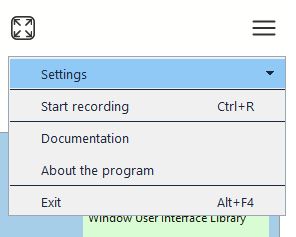

# Menu

The `menu` control provides a context menu with support for nested items.

## Quick Start

```cpp
#include <wui/control/menu.hpp>

auto menu = std::make_shared<wui::menu>();

wui::menu_items_t items = {
    {1, wui::normal, "Open", "Ctrl+O", nullptr, {}, [](int32_t id) {
        open_file();
    }},
    {2, wui::normal, "Save", "Ctrl+S", nullptr, {}, [](int32_t id) {
        save_file();
    }},
    {3, wui::separator, "", "", nullptr, {}, nullptr},
    {4, wui::normal, "Exit", "Alt+F4", nullptr, {}, [](int32_t id) {
        exit_app();
    }}
};

menu->set_items(items);

// Show on right click
window->subscribe([&menu](const wui::event& ev) {
    if (ev.type == wui::event_type::mouse && 
        ev.mouse_event_.type == wui::mouse_event_type::right_up) {
        menu->show_on_point(ev.mouse_event_.x, ev.mouse_event_.y);
    }
}, wui::event_type::mouse);
```

## Menu Item States

```cpp
enum menu_item_state {
    normal,      // Normal item
    separator,   // Separator
    expanded,    // Expanded (with submenu)
    disabled     // Disabled
};
```




## API

### Methods

```cpp
// Manage items
void set_items(const menu_items_t &mi);
void update_item(const menu_item &mi);
void swap_items(int32_t first_item_id, int32_t second_item_id);
void delete_item(int32_t id);

// Item height
void set_item_height(int32_t item_height);

// Show
void show_on_control(std::shared_ptr<i_control> control, 
                     int32_t indent, int32_t x = -1, int32_t y = -1);
void show_on_point(int32_t x, int32_t y);
```

## See Also

- [Image](image.md) — for icons in menu
- [List](list.md) — often used with context menu
