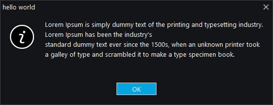

# Message

The `message` class provides modal dialogs for displaying messages to the user.

## Quick Start

```cpp
#include <wui/control/message.hpp>

auto msg = std::make_shared<wui::message>(main_window);
msg->show(
    "Operation completed successfully",
    "Information",
    wui::message_icon::information,
    wui::message_button::ok,
    [](wui::message_result result) {
        if (result == wui::message_result::ok) {
            // User clicked OK
        }
    }
);
```

## Icons

```cpp
enum class message_icon {
    information,  // Information (i)
    question,     // Question (?)
    alert,        // Warning (!)
    stop          // Error (X)
};
```

## Buttons

```cpp
enum class message_button {
    ok, ok_cancel, abort_retry_ignore,
    yes_no, yes_no_cancel, retry_cancel,
    cancel_try_continue
};
```

## Results

```cpp
enum class message_result {
    undef, ok, cancel, yes, no,
    abort, retry, ignore, try_, continue_
};
```



## API

```cpp
message(std::shared_ptr<window> transient_window_,
        bool docked_ = true,
        std::shared_ptr<i_theme> theme_ = nullptr);

void show(std::string_view message_, std::string_view title_,
          message_icon icon_, message_button button_,
          std::function<void(message_result)> result_callback);

message_result get_result() const;
```

## See Also

- [Button](button.md)
- [Image](image.md)
