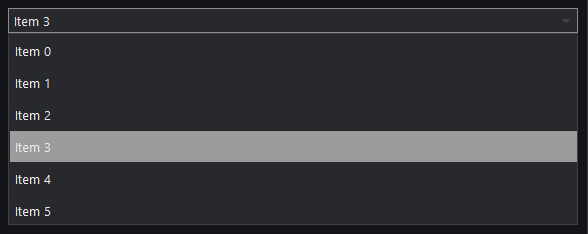

# Select

The `select` control provides a dropdown list for selecting one value from many.

## Quick Start

```cpp
#include <wui/control/select.hpp>

auto select = std::make_shared<wui::select>();

wui::select_items_t items = {
    {1, "Option 1"},
    {2, "Option 2"},
    {3, "Option 3"}
};

select->set_items(items);
select->select_item_number(0);

select->set_change_callback([](int32_t index, int64_t id) {
    std::cout << "Selected: " << index << " (ID: " << id << ")" << std::endl;
});

window->add_control(select, {10, 10, 150, 30});
```

## API



```cpp
// Manage items
void set_items(const select_items_t &items);
void update_item(const select_item &mi);
void delete_item(int64_t id);

// Selection
void select_item_number(int32_t index);
void select_item_id(int64_t id);
select_item selected_item() const;

// Callback
void set_change_callback(std::function<void(int32_t, int64_t)> cb);
```

## See Also

- [List](list.md) — uses list internally
- [Button](button.md) — for dropdown button
