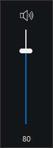

# Slider

The `slider` control provides a slider for selecting a value from a range.

## Quick Start

```cpp
#include <wui/control/slider.hpp>

auto slider = std::make_shared<wui::slider>(
    0, 100, 50,
    [](int32_t value) {
        std::cout << "Value: " << value << std::endl;
    }
);
window->add_control(slider, {10, 10, 200, 30});
```

## Orientation



```cpp
enum class slider_orientation {
    vertical, horizontal
};
```

## API

```cpp
slider(int32_t from, int32_t to, int32_t value,
       std::function<void(int32_t)> change_callback,
       slider_orientation orientation = slider_orientation::horizontal,
       std::string_view theme_control_name = tc,
       std::shared_ptr<i_theme> theme_ = nullptr);

// Range
void set_range(int32_t from, int32_t to);

// Value
void set_value(int32_t value);
int32_t get_value() const;

// Centered mode (for ranges like -7..+7)
void set_centered_mode(bool centered);

// Callbacks
void set_callback(std::function<void(int32_t)> cb);
void set_drag_end_callback(std::function<void()> cb);
```

## See Also

- [Progress](progress.md) — progress indicator
- [Visual Themes](../base/theme.md)
