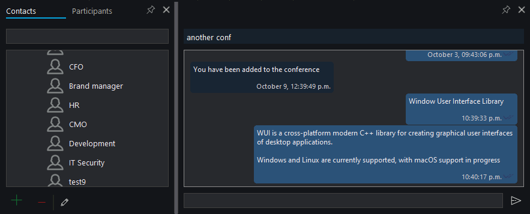

# Splitter

The `splitter` control provides a draggable divider for resizing areas.

## Quick Start

```cpp
#include <wui/control/splitter.hpp>

auto splitter = std::make_shared<wui::splitter>(
    wui::splitter_orientation::vertical,
    [](int32_t x, int32_t y) {
        std::cout << "Splitter moved to: " << x << ", " << y << std::endl;
    }
);
window->add_control(splitter, {200, 10, 210, 400});
```

## Orientation



```cpp
enum class splitter_orientation {
    vertical, horizontal
};
```

## API

```cpp
splitter(splitter_orientation orientation,
         std::function<void(int32_t, int32_t)> callback,
         std::string_view theme_control_name = tc,
         std::shared_ptr<i_theme> theme_ = nullptr);

// Callback
void set_callback(std::function<void(int32_t, int32_t)> cb);

// Margins
void set_margins(int32_t min_, int32_t max_);
```

## See Also

- [Panel](panel.md) — for split areas
- [Visual Themes](../base/theme.md)
