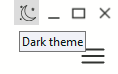

# Tooltip

The `tooltip` control provides popup hints for interface elements.

## Quick Start

```cpp
#include <wui/control/tooltip.hpp>

auto tooltip = std::make_shared<wui::tooltip>("This is a helpful tooltip");

auto button = std::make_shared<wui::button>("Hover me", []() {});
window->add_control(button, {10, 10, 100, 30});

button->set_callback([&tooltip, &button]() {
    tooltip->show_on_control(*button, 5);
});
```

## API



```cpp
tooltip(std::string_view text, 
        std::string_view theme_control_name = tc,
        std::shared_ptr<i_theme> theme_ = nullptr);

// Show on control
void show_on_control(i_control &control, int32_t indent);

// Set text
void set_text(std::string_view text_);
```

## See Also

- [Image](image.md)
- [Button](button.md)
- [Visual Themes](../base/theme.md)
