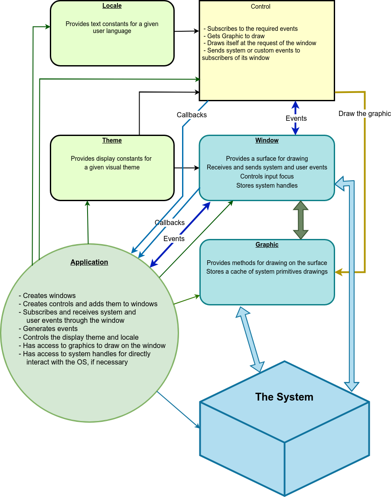

# Welcome to WUI

WUI is an attempt to make an easy to use and as fast as possible cross-platform library for creating a modern C++ graphical user interface. The library uses C++11 and has a minimalistic API.

## Tasks for UI framework
- Run on Windows (At least 7, but works on XP as well)
- Run on Linux (Starting with Ubuntu 16 / CentOS6)
- Run on macOS
- Open windows and display controls on them. 
- Provide a common interface to the drawing subsystem that hides platform-dependent methods. This will allow you to write a control once, on any platform, and it will look and behave the same on all.
- Provide a common interface to events. Any control or user can subscribe to any message group, including custom ones, with the ability to send/receive messages asynchronously.
- Accept system messages, respond to mouse, keyboard and other events.
- Have the ability to change the color scheme / style / icons / images of all controls / windows from one place. Store all visual settings of the application in json, including having the ability to store images in it as well.
- Provide a system of text constants for titles and labels depending on the language selected.
- Have the ability to detach / attach windows from each other.
- Provide an implementation of basic UI controls and have a clear and accessible way for third party developers to add new controls for their applications.
- Have a user-friendly interface for working with application configs. Windows registry and ini files are supported. Naturally, with the possibility of modification.

## General scheme of the framework

Everything is based on two entities - Window and Control. A window can contain controls, and the window itself is a control.

[Control](base/interfaces.md#control) is any visual element for user interaction - button, input field, list, menu, etc.
Control knows how to handle events coming from Window, stores its states, and draws itself on the graphical context provided by the window containing it.

[Window](base/interfaces.md#window) - receives system events and provides their distribution to subscribers. The window also commands its controllers to redraw and provides them with their own graphic. In addition, the window controls the input focus, can do modality and send an event to the subscribed user or to the system.

[Graphic](base/graphic.md) is the third base entity that provides an interface to the system's drawing methods. Currently, drawing is implemented on Windows GDI/GDI+ and Linux xcb/cairo. Of course, there is no obstacle to implement drawing on vulcan/bare metal/etc.

The library also has auxiliary tools for operation - structures [common](base/common.md) (contains such basic types as ``rect``, ``color``, ``font``), [event](base/event.md) (``mouse``, ``keyboard``, ``internal`` and ``system events``), [graphic](base/graphic.md) (for physical drawing on the system graphic context) [theme](base/theme.md) (a system of constants for convenient support of visual themes) and ``locale`` (a subsystem for convenient storage of textual content).

## Platforms

The following platforms are currently supported:

* Windows (WinAPI + GDI)
* Linux (X11 + xcb)

Work on MacOS platform will be completed soon.

All platform-dependent code is collected in two elements - [window](base/interfaces.md) and [graphic](base/graphic.md) (rendering subsystem).

## Fundamental Principles

In general terms, the application workflow is as follows:

The window receives system events such as: need to render, mouse and keyboard input, device changes, user messages. These messages are passed to the subscribers of window events, these are firstly, the controls contained on the window, and secondly, the user code of the application, if necessary. To simplify the work, it is possible to receive only events related to the control - mouse in the rectangle occupied by the control, keyboard, if the control owns the input focus.

Receiving messages/events from a control is performed by callbacks specific to that control. This allowed us to radically simplify the event system without losing in functionality and, in our opinion, winning in brevity.

When it is necessary to draw a part of the window, we search for controls falling into the redrawing area and call the draw() method of each control sequentially, according to the order of adding controls to the window. Controls responding to the topmost() true are drawn last, to be at the top of the control stack.

## Quick start

* [Receive, build and setup](howto/setup.md)
* [Hello world application](howto/hello-world.md)

## Handbook

* [Main application loop](base/main-loop.md)
* [Resources](base/resources.md)

* [Transient / Modal](base/transient.md)

* [Visual themes](base/theme.md)
* [Locales](base/locale.md)
* [Config](base/config.md)

* [Multithreading](base/multithreading.md)
* [Unicode](base/unicode.md)
* [Error Handling](controls/error-handling.md)

* [Controls](controls/all.md)

* [Dependencies](base/dependencies.md)

## Contacts:

* Email: [info@libwui.org](mailto:info@libwui.org)
* GitHub tracker: [https://github.com/ud84/wui/issues](https://github.com/ud84/wui/issues)
* Telegram: [Official WUI channel](https://t.me/libwui)
