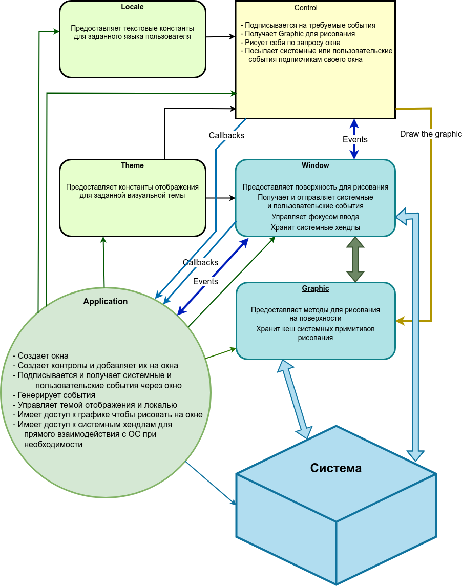

# Пошаговое руководство по созданию приложения на WUI

## Введение

Всё началось почти два года назад, в декабре. Наш основной проект (видеомессенджер) использовал WTL для Windows и GTKmm для Linux. Поддержки Mac не было. Таскать за собой две идентичные кодовые базы, которые должны делать всё строго одинаково, было огромной проблемой. Конечно, это никогда не работало как надо. Мысль о создании ещё одного нативного клиента для Mac вызывала нервный тик...

На разумный вопрос — почему сразу не сделали на Qt, могу ответить только так: это связано, скажем так, с гастрономическими предпочтениями и, отчасти, с любовью к монолитным exe. Да и в начале мне не нужно было ничего, кроме Windows.

За шесть лет жизни с двумя кодовыми базами одного и того же продукта, мы постепенно подбирали лёгкие UI-библиотеки, написанные хотя бы в стиле C++17.

Должен сказать, что мы активно используем boost и любим его настолько, насколько можно любить всей душой...

В 2021 году, видимо, Google плохо работал или звёзды не сошлись, но ничего стоящего найдено не было. Всё, что удавалось найти — проекты на базе HTML-рендеринга и обёртки над wxWidgets. Теперь мы знаем о lvgl, да... Но в целом их тысячи.

wxWidgets неплох, но мне хотелось собственной отрисовки, без рамок для кнопок, полей ввода и списков, лицензии типа boost/BSD, максимально лаконичный, и в идеале работающий от Windows XP / CentOS 6 на стандартном GDI / X11 до Vulkan на современных машинах.

В итоге было решено сделать минимальный UI-фреймворк для этого проекта и сразу выпустить его в Open Source под лицензией Boost.

## Задачи для UI фреймворка

- Работать на Windows (как минимум 7, но работает и на XP)
- Работать на Linux (начиная с Ubuntu 16 / CentOS 6)
- Работать на macOS
- Открывать окна и отображать на них контролы
- Предоставлять общий интерфейс к подсистеме рисования, скрывающий платформозависимые методы
- Предоставлять общий интерфейс к событиям
- Принимать системные сообщения, реагировать на мышь, клавиатуру и прочие события
- Иметь возможность менять цветовую гамму / стиль / иконки / изображения всех контролов/окон из одного места
- Предоставлять систему текстовых констант для заголовков и надписей в зависимости от выбранного языка
- Иметь возможность откреплять / прикреплять окна друг от друга
- Предоставлять реализацию основных UI контролов
- Иметь удобный интерфейс для работы с конфигами приложений

## Общая схема фреймворка



Всё базируется на двух сущностях — Window и Control. Окно может содержать контролы, также само окно является контролом.

**Control** — это любой визуальный элемент для взаимодействия с пользователем: кнопка, поле ввода, список, меню и т.д. Control знает, как обрабатывать события, поступающие от Window, хранит свои состояния и рисует себя на графическом контексте, который предоставляется содержащим его окном.

**Window** — принимает системные события и обеспечивает их рассылку подписчикам. Так же окно даёт команду на перерисовку своих контролов и предоставляет им свой graphic. Кроме этого, окно управляет фокусом ввода, может сделать модальность и отправить подписанному пользователю или в систему событие.

**Graphic** — предоставляет интерфейс к системным методам рисования. В настоящий момент реализовано рисование на Windows GDI/GDI+ и Linux xcb/cairo.

В библиотеке также есть вспомогательные средства: common (rect, color, font), event (мышь, клавиатура, внутренние и системные события), theme (система констант для визуальных тем), locale (подсистема для хранения текстового контента), config (для работы с настройками приложения).

## Основополагающие принципы

Окно принимает системные события: необходимость отрисовки, ввод с мыши и клавиатуры, изменения устройств, пользовательские сообщения. Эти сообщения передаются подписчикам событий окна — контролам и пользовательскому коду.

Получение событий от контрола производится специфическими для каждого контрола коллбэками. Это позволило упростить систему событий без потери функциональности.

При необходимости отрисовки части окна производится поиск попадающих в область перерисовки контролов и последовательно вызывается `draw()` каждого контрола. Контролы с `topmost() == true` рисуются последними.

## Главный цикл приложения

### Windows

```cpp
MSG msg;
while (GetMessage(&msg, nullptr, 0, 0))
{
    TranslateMessage(&msg);
    DispatchMessage(&msg);
}
```

### Linux

```cpp
void window::process_events()
{
    xcb_generic_event_t *e = nullptr;
    while (started && (e = xcb_wait_for_event(context_.connection)))
    {
        switch (e->response_type & ~0x80)
        {
            case XCB_EXPOSE:
            // ...
        }
    }
}
```

### Основной цикл приложения

```cpp
int main()
{
    wui::framework::init();

    MainFrame mainFrame;
    mainFrame.Run();

    wui::framework::run();
    return 0;
}
```

Закрытие окна:

```cpp
void MainFrame::Run()
{
    window->init(wui::locale("main_frame", "caption"),
        { -1, -1, width, height },
        wui::window_style::frame, [this]() {
            wui::framework::stop();
        });
}
```

## Транзиентность (модальность)

Для реализации модальных диалогов окно имеет метод:

```cpp
void set_transient_for(std::shared_ptr<window> window_, bool docked = true);
```

Флаг `docked` указывает, что модальное окно должно отображаться в базовом без создания физического системного окна.

## Ресурсы (темы и локали)

Приложение всегда имеет текущую тему и локаль. Это конфиги, которые дают значения для пары секция + ключ.

### Пример темы (dark.json)

```json
{
  "controls": [
    {
      "type": "window",
      "background": "#131519",
      "border": "#404040",
      "border_width": 1,
      "text": "#f5f5f0",
      "caption_font": {
        "name": "Segoe UI",
        "size": 18
      }
    },
    {
      "type": "image",
      "resource": "IMAGES_DARK",
      "path": "~/.hello_wui/res/images/dark"
    }
  ]
}
```

### Пример темы (light.json)

```json
{
  "controls": [
    {
      "type": "window",
      "background": "#fffffe",
      "border": "#9a9a9a",
      "text": "#191914"
    },
    {
      "type": "image",
      "resource": "IMAGES_LIGHT",
      "path": "~/.hello_wui/res/images/light"
    }
  ]
}
```

## Многопоточность

WUI не использует мутексы. Все коллбэки и системные события приходят из одного потока (wnd_proc на Windows или поток ожидания xcb_wait_for_event() на Linux).

Рекомендуется выполнять все UI-манипуляции либо в коллбэках, либо в одном специальном UI-потоке приложения.

## Unicode

Используется только UTF-8 в обычном `std::string` / `char*`.

Для взаимодействия с WinAPI, которому нужен utf16 в `wchar_t`, используется `boost::nowide::widen()` / `boost::nowide::narrow()`.

Подробнее о том, почему wchar не нужен: [https://utf8everywhere.org/](https://utf8everywhere.org/)

## Обработка ошибок

WUI не использует исключения. Методы, которые могут завершиться ошибкой, возвращают `bool`. Для получения деталей используется `get_error()`:

```cpp
struct error
{
    error_type type;
    std::string component, message;
    bool is_ok() const;
};
```

Проверка ошибки после конструктора:

```cpp
auto img = std::make_shared<wui::image>(IMG_LOGO);
if (!img->get_error().is_ok()) {
    log("error", img->get_error().str());
}
```

## Hello World приложение

В качестве основы для любого проекта предлагается минимальное приложение, которое сразу сделано с возможностью расширения до большого проекта.

Приложение находится в `examples/hello_world` и включает все необходимые файлы ресурсов.

[main.cpp](https://github.com/intent-garden/wui/blob/main/examples/hello_world/hw.cpp)

Демо-приложение показывает логотип, отображает подпись и предоставляет поле ввода. При нажатии на кнопку отображается диалог сообщения и приложение закрывается.


На следующем скриншоте тема изменена на светлую, язык на русский и нажата кнопка "Nice to meet you"


[MainFrame.h](https://github.com/intent-garden/wui/blob/main/examples/hello_world/MainFrame/MainFrame.h)
[MainFrame.cpp](https://github.com/intent-garden/wui/blob/main/examples/hello_world/MainFrame/MainFrame.cpp)

## Контролы

На данный момент реализовано 14 контролов:

### button

Кнопка может быть следующих видов:
- text
- image
- image_right_text
- image_bottom_text
- switcher
- radio
- anchor
- sheet


### image

Изображение для единообразного отображения иконок с учётом визуальной темы.

```cpp
auto logoImage = std::make_shared<wui::image>(IMG_LOGO);
```

### input


Стандартное поле ввода с поддержкой различных режимов.

### list

Вертикальный список элементов с прокруткой.


### menu

Контекстное меню с поддержкой вложенных пунктов.


И другие контролы: panel, progress, select, slider, splitter, tooltip, tray, message, text, scroll.

[Полный список контролов](../controls/all.md)
