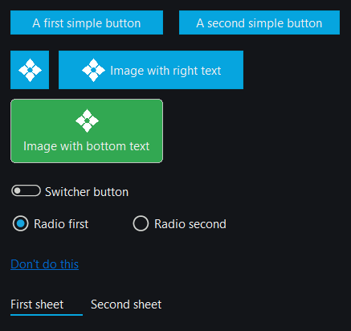

# Кнопка (button)

Кнопка — основной элемент управления для взаимодействия с пользователем.

## Быстрый старт

```cpp
#include <wui/control/button.hpp>

// Простая текстовая кнопка
auto btn = std::make_shared<wui::button>("Click me", []() {
    std::cout << "Button clicked!" << std::endl;
});
window->add_control(btn, {10, 10, 100, 30});

// Кнопка с изображением
auto img_btn = std::make_shared<wui::button>("Save", []() {
    save_document();
}, wui::button_view::image_right_text, "res/save.png", 16);
window->add_control(img_btn, {10, 50, 100, 30});
```

## Виды кнопок

```cpp
enum class button_view
{
    text,              // Текстовая кнопка
    image,             // Только изображение
    image_right_text,  // Изображение справа от текста
    image_bottom_text, // Изображение снизу от текста
    switcher,          // Переключатель
    radio,             // Радио-кнопка
    anchor,            // Ссылка
    sheet              // Кнопка-лист
};
```



## API

### Конструкторы

```cpp
// Текстовая кнопка
button(std::string_view caption, std::function<void(void)> click_callback, 
       std::string_view theme_control_name = tc, 
       std::shared_ptr<i_theme> theme_ = nullptr);

// Кнопка с видом
button(std::string_view caption, std::function<void(void)> click_callback, 
       button_view button_view_, std::string_view theme_control_name = tc, 
       std::shared_ptr<i_theme> theme_ = nullptr);

// Кнопка с изображением (Windows - из ресурса)
button(std::string_view caption, std::function<void(void)> click_callback, 
       button_view button_view_, int32_t image_resource_index, 
       int32_t image_size, std::string_view theme_control_name = tc, 
       std::shared_ptr<i_theme> theme_ = nullptr);

// Кнопка с изображением (из файла)
button(std::string_view caption, std::function<void(void)> click_callback, 
       button_view button_view_, std::string_view image_file_name, 
       int32_t image_size, std::string_view theme_control_name = tc, 
       std::shared_ptr<i_theme> theme_ = nullptr);

// Кнопка с изображением (из данных)
button(std::string_view caption, std::function<void(void)> click_callback, 
       button_view button_view_, const std::vector<uint8_t> &image_data, 
       int32_t image_size, std::string_view theme_control_name = tc, 
       std::shared_ptr<i_theme> theme_ = nullptr);
```

### Методы

```cpp
// Установка текста
void set_caption(std::string_view caption);

// Установка вида
void set_button_view(button_view button_view_);

// Установка изображения
void set_image(int32_t resource_index);        // Windows
void set_image(std::string_view file_name);
void set_image(const std::vector<uint8_t> &image_data);

// Фокус
void enable_focusing();
void disable_focusing();

// Состояние переключателя
void turn(bool on);
bool turned() const;

// Коллбэк
void set_callback(std::function<void(void)> click_callback);
```

## Примеры

### Простая кнопка

```cpp
auto ok_button = std::make_shared<wui::button>("OK", []() {
    std::cout << "OK pressed" << std::endl;
});
window->add_control(ok_button, {100, 100, 150, 130});
```

### Кнопка-переключатель

```cpp
auto toggle = std::make_shared<wui::button>("Enabled", []() {
    // Обработка клика
}, wui::button_view::switcher);

toggle->turn(true); // Включено по умолчанию
window->add_control(toggle, {10, 10, 100, 30});
```

### Кнопка с иконкой

```cpp
#ifdef _WIN32
auto save_btn = std::make_shared<wui::button>(
    "Save", 
    []() { save_file(); },
    wui::button_view::image_right_text,
    IDI_SAVE_ICON,  // ID ресурса
    16              // Размер в пикселях
);
#else
auto save_btn = std::make_shared<wui::button>(
    "Save",
    []() { save_file(); },
    wui::button_view::image_right_text,
    "res/icons/save.png",
    16
);
#endif

window->add_control(save_btn, {10, 50, 120, 80});
```

## Темизация

Кнопка использует следующие значения из темы:

```json
{
  "type": "button",
  "calm": "#06a5df",
  "active": "#1aafe9",
  "disabled": "#a5a5a0",
  "border_width": 1,
  "round": 4,
  "font": "button_font"
}
```

## См. также

- [Визуальные темы](../base/theme.md)
- [Изображение](image.md)
