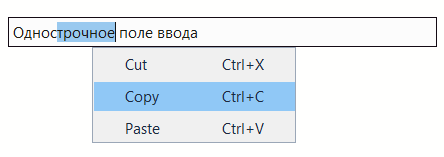

# Поле ввода (input)

Контрол `input` предоставляет текстовое поле ввода с поддержкой различных режимов работы.

## Быстрый старт

```cpp
#include <wui/control/input.hpp>

// Простое однострочное поле
auto name_input = std::make_shared<wui::input>("Enter name");
window->add_control(name_input, {10, 10, 200, 30});

// Многострочное поле
auto memo = std::make_shared<wui::input>(
    "", 
    wui::input_view::multiline
);
window->add_control(memo, {10, 50, 300, 150});

// Поле для пароля
auto password = std::make_shared<wui::input>(
    "", 
    wui::input_view::password
);
window->add_control(password, {10, 100, 200, 130});
```

## Режимы просмотра

```cpp
enum class input_view
{
    singleline,   // Однострочное
    multiline,    // Многострочное
    readonly,     // Только чтение
    password      // Пароль (символы скрываются)
};
```

## Типы содержимого

```cpp
enum class input_content
{
    text,       // Обычный текст
    integer,    // Целые числа
    numeric,    // Числа с плавающей точкой
    hostport,   // Хост:порт
    hexadecimal // 0-9, A-F, a-f
};
```



## Поведение редактора

- Текст хранится в UTF-8; курсор и лимиты учитывают кодовые точки, а не байты.
- Многострочное поле поддерживает выделение через пустые строки, Shift+стрелки и автопрокрутку при выделении мышью.
- `symbols_limit = -1` снимает лимит; по умолчанию он равен 10000. При вставке учитывается длина результата после замены выделения.
- Однострочные поля заменяют вставленные переводы строк пробелами. Маска пароля соответствует кодовым точкам.
- `integer`, `numeric`, `hostport`, `hexadecimal` фильтруют символы, но не заменяют полную проверку числа, имени хоста или порта.
- Read-only разрешает выделение/копирование, но запрещает редактирование. Enter в multiline редактирует текст; `set_return_callback()` служит для отправки в применимых однострочных режимах.
- Буфер обмена браузера имеет [платформенные ограничения](../howto/wasm.md).

## API

### Конструктор

```cpp
input(std::string_view text = "",
      input_view input_view_ = input_view::singleline,
      input_content input_content_ = input_content::text,
      int32_t symbols_limit = 10000,
      std::string_view theme_control_name = tc,
      std::shared_ptr<i_theme> theme_ = nullptr);
```

**Параметры:**
- `text` — начальный текст
- `input_view_` — режим просмотра
- `input_content_` — тип содержимого
- `symbols_limit` — ограничение на количество символов
- `theme_control_name` — имя в теме
- `theme_` — тема

### Методы

```cpp
// Текст
void set_text(std::string_view text);
std::string text() const;

// Настройки
void set_input_view(input_view input_view_);
input_view get_input_view() const;
void set_input_content(input_content input_content_);
void set_symbols_limit(int32_t symbols_limit);

// Коллбэки
void set_change_callback(std::function<void()> change_callback);
void set_return_callback(std::function<void()> return_callback);

// Для multiline
const std::vector<std::string>& get_lines() const;
void scroll_to_end();
```

## Примеры

### Форма входа

```cpp
// Логин
auto login_input = std::make_shared<wui::input>("Username");
window->add_control(login_input, {10, 10, 200, 30});

// Пароль
auto password_input = std::make_shared<wui::input>(
    "", 
    wui::input_view::password
);
password_input->set_return_callback([]() {
    // Enter нажат - отправляем форму
    login();
});
window->add_control(password_input, {10, 50, 200, 80});
```

### Многострочный редактор

```cpp
auto editor = std::make_shared<wui::input>(
    "", 
    wui::input_view::multiline,
    wui::input_content::text,
    10000  // 10K символов
);

editor->set_change_callback([&editor]() {
    auto lines = editor->get_lines();
    std::cout << "Lines count: " << lines.size() << std::endl;
});

window->add_control(editor, {10, 10, 400, 300});
```

### Поле для числа

```cpp
auto port_input = std::make_shared<wui::input>(
    "8080",
    wui::input_view::singleline,
    wui::input_content::integer,
    5  // Максимум 5 символов
);
window->add_control(port_input, {10, 10, 100, 30});
```

### Поле только для чтения

```cpp
auto status = std::make_shared<wui::input>(
    "Connected to server",
    wui::input_view::readonly
);
window->add_control(status, {10, 10, 200, 30});
```

## Темизация

```json
{
  "type": "input",
  "background": "#ffffff",
  "text": "#000000",
  "selection": "#0078d7",
  "cursor": "#000000",
  "border": "#cccccc",
  "border_width": 1,
  "hover_border": "#999999",
  "focused_border": "#0078d7",
  "round": 4,
  "font": {"name": "Segoe UI", "size": 18}
}
```

## Локализация

Контекстное меню input использует следующие ключи:

```json
{
  "input": {
    "copy": "Копировать",
    "cut": "Вырезать",
    "paste": "Вставить"
  }
}
```

## См. также

- [Локали](../base/locale.md)
- [Визуальные темы](../base/theme.md)
