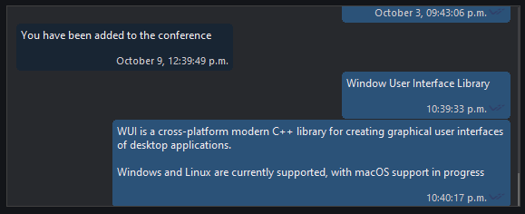
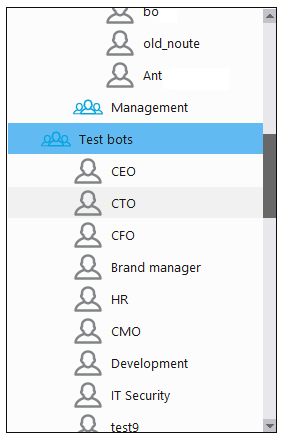

# Список (list)

Контрол `list` предоставляет список элементов с поддержкой колонок и прокрутки.

## Быстрый старт

```cpp
#include <wui/control/list.hpp>

auto list = std::make_shared<wui::list>();

// Настройка колонок
list->update_columns({
    {100, "Name"},
    {150, "Date"},
    {80, "Size"}
});

// Установка количества элементов
list->set_item_count(100);

// Обработчик отрисовки
list->set_draw_callback([](wui::graphic& gr, int32_t n_item, 
                            wui::rect item_rect, wui::list::item_state state) {
    // Отрисовка элемента
    std::string text = get_item_text(n_item);
    gr.draw_text(item_rect, text);
});

window->add_control(list, {10, 10, 400, 300});
```

## Режимы

```cpp
enum class list_mode
{
    simple,       // Простой список
    auto_select,  // Автовыделение
    simple_topmost// Простой с поверх других
};
```

## Состояния элемента

```cpp
enum class item_state
{
    normal,    // Обычное
    active,    // Под курсором
    selected   // Выбранное
};
```





## API

### Конструктор

```cpp
list(std::string_view theme_control_name = tc, 
     std::shared_ptr<i_theme> theme_ = nullptr);
```

### Методы

```cpp
// Колонки
void update_columns(const std::vector<column> &columns_);
const std::vector<column> &columns();
void set_column_width(int32_t n_column, int32_t width);

// Режим
void set_mode(list_mode mode);

// Элементы
void set_item_count(int32_t count);
int32_t get_item_count() const;
void select_item(int32_t n_item);
int32_t selected_item() const;
void make_selected_visible();
void scroll_to_start();
void scroll_to_end();

// Размеры
int32_t get_item_height(int32_t n_item) const;
void set_item_height_callback(std::function<void(int32_t, int32_t&)> cb);

// Коллбэки
void set_draw_callback(std::function<void(graphic&, int32_t, rect, item_state)> cb);
void set_item_click_callback(std::function<void(click_button, int32_t, int32_t, int32_t)> cb);
void set_item_change_callback(std::function<void(int32_t)> cb);
void set_item_activate_callback(std::function<void(int32_t)> cb);
void set_column_click_callback(std::function<void(int32_t)> cb);
```

## Примеры

### Простой список

```cpp
auto simple_list = std::make_shared<wui::list>();
simple_list->set_mode(wui::list::list_mode::simple);

std::vector<std::string> items = {"Item 1", "Item 2", "Item 3"};

simple_list->set_item_count(items.size());
simple_list->set_draw_callback([&items](wui::graphic& gr, int32_t n_item, 
                                         wui::rect r, wui::list::item_state state) {
    gr.draw_text(r, items[n_item]);
});

window->add_control(simple_list, {10, 10, 200, 150});
```

### Список с колонками

```cpp
auto file_list = std::make_shared<wui::list>();

file_list->update_columns({
    {200, "Name"},
    {100, "Date Modified"},
    {80, "Size"},
    {100, "Type"}
});

struct FileItem {
    std::string name;
    std::string date;
    std::string size;
    std::string type;
};

std::vector<FileItem> files = get_files();

file_list->set_item_count(files.size());
file_list->set_draw_callback([&files](wui::graphic& gr, int32_t n_item, 
                                       wui::rect r, wui::list::item_state state) {
    const auto& file = files[n_item];
    gr.draw_text({r.left + 5, r.top, r.left + 200, r.bottom}, file.name);
    gr.draw_text({r.left + 205, r.top, r.left + 305, r.bottom}, file.date);
    gr.draw_text({r.left + 310, r.top, r.left + 390, r.bottom}, file.size);
    gr.draw_text({r.left + 395, r.top, r.right, r.bottom}, file.type);
});

window->add_control(file_list, {10, 10, 500, 300});
```

### Интерактивный список

```cpp
auto interactive_list = std::make_shared<wui::list>();

interactive_list->set_item_count(100);
interactive_list->set_draw_callback([](wui::graphic& gr, int32_t n_item, 
                                        wui::rect r, wui::list::item_state state) {
    gr.draw_text(r, "Item " + std::to_string(n_item + 1));
});

// Клик по элементу
interactive_list->set_item_click_callback(
    [](wui::list::click_button button, int32_t n_item, int32_t x, int32_t y) {
        if (button == wui::list::click_button::left) {
            std::cout << "Clicked on item: " << n_item << std::endl;
        }
    }
);

// Двойной клик (активация)
interactive_list->set_item_activate_callback([](int32_t n_item) {
    open_item(n_item);
});

// Клик по колонке
interactive_list->set_column_click_callback([](int32_t n_column) {
    sort_by_column(n_column);
});

window->add_control(interactive_list, {10, 10, 400, 300});
```

### Список с переменной высотой

```cpp
auto variable_list = std::make_shared<wui::list>();

variable_list->set_item_height_callback([](int32_t n_item, int32_t& height) {
    // Разная высота для разных элементов
    height = (n_item % 2 == 0) ? 40 : 60;
});

variable_list->set_item_count(50);
variable_list->set_draw_callback([](wui::graphic& gr, int32_t n_item, 
                                     wui::rect r, wui::list::item_state state) {
    gr.draw_text(r, "Item " + std::to_string(n_item + 1) + 
                    " (height: " + std::to_string(r.height()) + ")");
});

window->add_control(variable_list, {10, 10, 300, 400});
```

## Темизация

```json
{
  "type": "list",
  "background": "#ffffff",
  "border": "#cccccc",
  "border_width": 1,
  "text": "#000000",
  "grid": "#e0e0e0",
  "selected_item": "#cce8ff",
  "active_item": "#e5f3ff",
  "hover_item": "#f0f0f0",
  "column_header_background": "#f5f5f5",
  "column_header_text": "#333333",
  "scrollbar": "scrollbar",
  "font": "list_font"
}
```

## См. также

- [Select](select.md) — выпадающий список
- [Визуальные темы](../base/theme.md)
