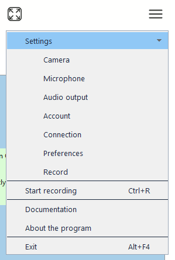

# Меню (menu)

Контрол `menu` предоставляет контекстное меню с поддержкой вложенных пунктов.

## Быстрый старт

```cpp
#include <wui/control/menu.hpp>

// Создание меню
auto menu = std::make_shared<wui::menu>();

// Определение пунктов
wui::menu_items_t items = {
    {1, wui::normal, "Open", "Ctrl+O", nullptr, {}, [](int32_t visible_index) {
        open_file();
    }},
    {2, wui::normal, "Save", "Ctrl+S", nullptr, {}, [](int32_t visible_index) {
        save_file();
    }},
    {3, wui::separator, "", "", nullptr, {}, nullptr},
    {4, wui::normal, "Exit", "Alt+F4", nullptr, {}, [](int32_t visible_index) {
        exit_app();
    }}
};

menu->set_items(items);
window->add_control(menu, {0});

// Показать по правому клику
window->subscribe([&menu](const wui::event& ev) {
    if (ev.type == wui::event_type::mouse && 
        ev.mouse_event_.type == wui::mouse_event_type::right_up) {
        menu->show_on_point(ev.mouse_event_.x, ev.mouse_event_.y);
    }
}, wui::event_type::mouse);
```

## Типы пунктов

```cpp
enum menu_item_state
{
    normal,      // Обычный пункт
    separator,   // Разделитель
    expanded,    // Развёрнутый (с подменю)
    disabled     // Неактивный
};
```




## Структура пункта

```cpp
struct menu_item
{
    int32_t id;                    // Уникальный ID
    menu_item_state state;         // Состояние
    std::string text;              // Текст
    std::string hotkey;            // Горячие клавиши
    std::shared_ptr<image> image_; // Иконка
    menu_items_t children;         // Подменю
    std::function<void(int32_t)> click_callback;
};
```

Callback получает индекс видимой строки, а не `menu_item::id`. Раскрытие дочерних элементов меняет индексы. При необходимости захватите стабильный ID в callback. `hotkey` — подпись: обработку клавиатурного сочетания задаёт приложение. Храните меню, пока оно подключено к окну.

## API

### Конструктор

```cpp
menu(std::string_view theme_control_name = tc, 
     std::shared_ptr<i_theme> theme_ = nullptr);
```

### Методы

```cpp
// Управление пунктами
void set_items(const menu_items_t &mi);
void update_item(const menu_item &mi);
void swap_items(int32_t first_item_id, int32_t second_item_id);
void delete_item(int32_t id);

// Высота пункта
void set_item_height(int32_t item_height);

// Показать
void show_on_control(std::shared_ptr<i_control> control, 
                     int32_t indent, int32_t x = -1, int32_t y = -1);
void show_on_point(int32_t x, int32_t y);
```

## Примеры

### Главное меню приложения

```cpp
auto main_menu = std::make_shared<wui::menu>();

wui::menu_items_t file_menu = {
    {101, wui::normal, "New", "Ctrl+N", nullptr, {}, [](int32_t) {
        new_document();
    }},
    {102, wui::normal, "Open...", "Ctrl+O", nullptr, {}, [](int32_t) {
        open_document();
    }},
    {103, wui::separator, "", "", nullptr, {}, nullptr},
    {104, wui::normal, "Save", "Ctrl+S", nullptr, {}, [](int32_t) {
        save_document();
    }},
    {105, wui::normal, "Save As...", "Ctrl+Shift+S", nullptr, {}, [](int32_t) {
        save_document_as();
    }},
    {106, wui::separator, "", "", nullptr, {}, nullptr},
    {107, wui::normal, "Exit", "Alt+F4", nullptr, {}, [](int32_t) {
        exit_application();
    }}
};

wui::menu_items_t edit_menu = {
    {201, wui::normal, "Undo", "Ctrl+Z", nullptr, {}, [](int32_t) {
        undo();
    }},
    {202, wui::normal, "Redo", "Ctrl+Y", nullptr, {}, [](int32_t) {
        redo();
    }},
    {203, wui::separator, "", "", nullptr, {}, nullptr},
    {204, wui::normal, "Cut", "Ctrl+X", nullptr, {}, [](int32_t) {
        cut();
    }},
    {205, wui::normal, "Copy", "Ctrl+C", nullptr, {}, [](int32_t) {
        copy();
    }},
    {206, wui::normal, "Paste", "Ctrl+V", nullptr, {}, [](int32_t) {
        paste();
    }}
};

wui::menu_items_t root_menu = {
    {1, wui::expanded, "File", "", nullptr, file_menu, nullptr},
    {2, wui::expanded, "Edit", "", nullptr, edit_menu, nullptr},
    {3, wui::expanded, "Help", "", nullptr, help_menu, nullptr}
};

main_menu->set_items(root_menu);
```

### Контекстное меню для списка

```cpp
auto list_menu = std::make_shared<wui::menu>();

wui::menu_items_t items = {
    {1, wui::normal, "Add", "", nullptr, {}, [](int32_t) {
        list->add_item("New item");
    }},
    {2, wui::separator, "", "", nullptr, {}, nullptr},
    {3, wui::normal, "Delete", "Del", nullptr, {}, [&list](int32_t) {
        list->delete_item(list->selected_item());
    }},
    {4, wui::normal, "Properties", "Enter", nullptr, {}, [&list](int32_t) {
        show_properties(list->selected_item());
    }}
};

list_menu->set_items(items);
window->add_control(menu, {0});

// Показать при правом клике на списке
list_menu->show_on_control(list, 5);
```

### Меню с иконками

```cpp
auto icon_menu = std::make_shared<wui::menu>();

auto new_icon = std::make_shared<wui::image>("res/new.png");
auto open_icon = std::make_shared<wui::image>("res/open.png");
auto save_icon = std::make_shared<wui::image>("res/save.png");

wui::menu_items_t items = {
    {1, wui::normal, "New", "Ctrl+N", new_icon, {}, [](int32_t) {
        new_file();
    }},
    {2, wui::normal, "Open...", "Ctrl+O", open_icon, {}, [](int32_t) {
        open_file();
    }},
    {3, wui::normal, "Save", "Ctrl+S", save_icon, {}, [](int32_t) {
        save_file();
    }}
};

icon_menu->set_items(items);
window->add_control(menu, {0});
```

## Темизация

```json
{
  "type": "menu",
  "background": "#ffffff",
  "border": "#cccccc",
  "border_width": 1,
  "text": "#000000",
  "item_height": 24,
  "hover_background": "#e5f3ff",
  "selected_background": "#cce8ff",
  "separator": "#e0e0e0",
  "hotkey": "#888888",
  "round": 4,
  "font": {"name": "Segoe UI", "size": 18}
}
```

## См. также

- [Изображение](image.md) — для иконок в меню
- [Список](list.md) — часто используется с контекстным меню
