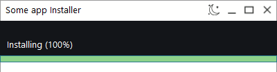

# Панель (panel)

Контрол `panel` — контейнер для группировки элементов или создания пользовательских областей рисования.

## Быстрый старт

```cpp
#include <wui/control/panel.hpp>

// Простая панель
auto panel = std::make_shared<wui::panel>();
window->add_control(panel, {10, 10, 200, 100});

// Панель с callback для рисования
auto custom_panel = std::make_shared<wui::panel>(
    [](wui::graphic& gr) {
        // Пользовательская отрисовка
        gr.draw_rect({0, 0, 100, 50}, wui::make_color(255, 0, 0));
    }
);
window->add_control(custom_panel, {10, 120, 200, 200});
```

## API



### Конструкторы

```cpp
// Пустая панель
panel(std::string_view theme_control_name = tc, 
      std::shared_ptr<i_theme> theme_ = nullptr);

// Панель с callback для рисования
panel(std::function<void(wui::graphic&)> draw_callback, 
      std::string_view theme_control_name = tc, 
      std::shared_ptr<i_theme> theme_ = nullptr);
```

## Примеры

### Разделительная панель

```cpp
// Панель для группировки элементов формы
auto form_panel = std::make_shared<wui::panel>();
form_panel->set_position({10, 10, 300, 200});
window->add_control(form_panel);

// Добавляем элементы на панель
auto name_label = std::make_shared<wui::text>("Name:");
auto name_input = std::make_shared<wui::input>();
window->add_control(name_label, {20, 20, 60, 40});
window->add_control(name_input, {70, 20, 200, 40});
```

### Пользовательская отрисовка

```cpp
// Панель с градиентом
auto gradient_panel = std::make_shared<wui::panel>(
    [](wui::graphic& gr) {
        // Рисуем градиент
        for (int y = 0; y < 100; y++) {
            auto color = wui::make_color(100 + y, 150, 200);
            gr.draw_rect({0, y, 200, y + 1}, color);
        }
    }
);
window->add_control(gradient_panel, {10, 10, 200, 100});
```

### Индикатор состояния

```cpp
auto status_panel = std::make_shared<wui::panel>(
    [is_online](wui::graphic& gr) {
        auto color = is_online ? 
            wui::make_color(0, 200, 0) :   // Зелёный
            wui::make_color(200, 0, 0);    // Красный
        
        gr.draw_circle({25, 25, 50, 50}, color, true);
    }
);
window->add_control(status_panel, {10, 10, 50, 50});
```

## Темизация

```json
{
  "type": "panel",
  "background": "#f0f0f0"
}
```

## См. также

- [Графика](../base/graphic.md) — для работы с graphic
- [Визуальные темы](../base/theme.md)
