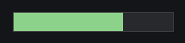

# Индикатор прогресса (progress)

Контрол `progress` отображает прогресс выполнения операции.

## Быстрый старт

```cpp
#include <wui/control/progress.hpp>

// Горизонтальный прогресс
auto progress = std::make_shared<wui::progress>(
    0,    // от
    100,  // до
    0     // текущее значение
);
window->add_control(progress, {10, 10, 200, 20});

// Вертикальный прогресс
auto v_progress = std::make_shared<wui::progress>(
    0, 100, 0,
    wui::orientation::vertical
);
window->add_control(v_progress, {10, 50, 20, 200});
```

## Ориентация



```cpp
enum class orientation
{
    horizontal,  // Горизонтальный
    vertical     // Вертикальный
};
```

## API

### Конструктор

```cpp
progress(int32_t from, int32_t to, int32_t value, 
         orientation orientation_ = orientation::horizontal, 
         std::string_view theme_control_name = tc, 
         std::shared_ptr<i_theme> theme_ = nullptr);
```

**Параметры:**
- `from` — начало диапазона
- `to` — конец диапазона
- `value` — текущее значение
- `orientation_` — ориентация
- `theme_control_name` — имя в теме
- `theme_` — тема

### Методы

```cpp
// Диапазон
void set_range(int32_t from, int32_t to);

// Значение
void set_value(int32_t value);

// Коллбэк для клика
void set_click_callback(std::function<void(int32_t, bool)> click_callback);

// Точки на прогрессе
void set_point(int32_t value, bool is_max);
```

## Примеры

### Загрузка файла

```cpp
auto download_progress = std::make_shared<wui::progress>(0, 100, 0);
window->add_control(download_progress, {10, 10, 300, 20});

// В процессе загрузки
void on_download_progress(size_t current, size_t total) {
    int percent = (current * 100) / total;
    download_progress->set_value(percent);
}
```

### Вертикальный индикатор громкости

```cpp
auto volume_progress = std::make_shared<wui::progress>(
    0, 100, 50,
    wui::orientation::vertical
);
volume_progress->set_click_callback([](int32_t value, bool is_max) {
    set_volume(value);
});
window->add_control(volume_progress, {10, 10, 30, 200});
```

### Прогресс с маркерами

```cpp
auto progress = std::make_shared<wui::progress>(0, 100, 0);

// Устанавливаем маркеры
progress->set_point(25, false);   // Минимальная точка
progress->set_point(75, true);    // Максимальная точка

window->add_control(progress, {10, 10, 300, 20});
```

### Неопределённый прогресс

```cpp
// Для операций с неизвестной длительностью
auto indeterminate = std::make_shared<wui::progress>(0, 100, 0);
window->add_control(indeterminate, {10, 10, 200, 20});

// Анимация
int value = 0;
auto timer = std::make_shared<wui::timer>(window, 100, [&]() {
    value = (value + 5) % 100;
    indeterminate->set_value(value);
});
```

## Темизация

```json
{
  "type": "progress",
  "border": "#cccccc",
  "border_width": 1,
  "background": "#f0f0f0",
  "meter": "#06a5df",
  "round": 4,
  "meter_positive": "#4caf50",
  "meter_negative": "#f44336"
}
```

## См. также

- [Slider](slider.md) — для ручного ввода значения
- [Визуальные темы](../base/theme.md)
