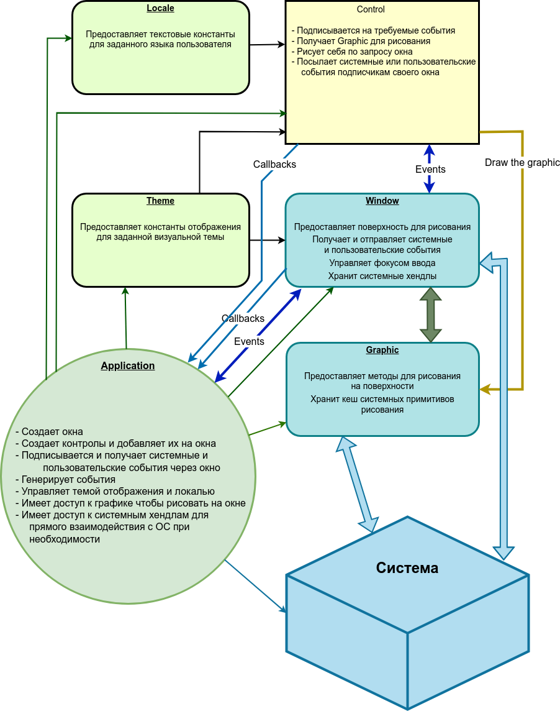

# Добро пожаловать в WUI

WUI - минималистичная, C++17 кроссплатформенная библиотека для создания современного графического интерфейса десктопных приложений.

## Задачи для UI фреймворка
- Работать на Windows (Как минимум 7, но работает и на XP)
- Работать на Linux (Начиная от условной Ubuntu 16 / CentOS6)
- Работать на macOS
- Открывать окна и отображать на них контролы. 
- Предоставлять общий интерфейс к подсистеме рисования, который скрывает платформенно-зависимые методы. Это позволят написать контрол один раз, на любой платформе, и он будет выглядеть и вести себя одинаково на всех.
- Предоставлять общий интерфейс к событиям. Любой контрол или пользователь может подписаться на любую группу сообщений, в том числе пользовательскую, с возможностью асинхронной отправки/получения сообщений.
- Принимать системные сообщения, реагировать на мышь, клавиатуру и прочие события.
- Иметь возможность менять цветовую гамму / стиль / пиктограммы / изображения всех контролов / окон из одного места. Хранить все визуальные настройки приложения в json, в том числе иметь возможность хранить в нем же изображения.
- Предоставлять систему текстовых констант для заголовков и надписей в зависимости от выбранного языка.
- Иметь возможность откреплять / прикреплять окна друг от друга.
- Предоставлять реализацию основных UI контролов и иметь понятную и доступную возможность добавления новых контролов сторонними разработчиками для своих приложений.
- Иметь удобный интерфейс для работы с конфигами приложений. Поддерживается реестр Windows и ini файлы. Естественно, с возможностью изменения.

## Общая схема фреймворка

Все базируется на двух сущностях - Window и Control. Окно может содержать контролы, также само окно является контролом.

[Control](base/interfaces.md#control) - это любой визуальный элемент для взаимодействия с пользователем - кнопка, поле ввода, список, меню и т.д.
Control знает, как обрабатывать события, поступающие от Window, хранит свои состояния и рисует себя на графическом контексте, который предоставляется содержащим его окном.

[Window](base/interfaces.md#window) - принимает системные события и обеспечивает их рассылку подписчикам. Так же окно дает команду на перерисовку своих контролов и предоставляет им свой graphic. Кроме этого, окно управляет фокусом ввода, может сделать модальность и отправить подписанному пользователю или в систему событие.

[Graphic](base/graphic.md) - это третья базовая сущность которая предоставляет интерфейс к системным методам рисования. В настоящий момент реализовано рисование на Windows GDI/GDI+ и Linux xcb/cairo. Разумеется, нет никаких препятствий реализовать рисование на vulcan/bare metal/etc.

В библиотеке также есть вспомогательные средства для работы - структуры [common](base/common.md) (содержит такие основные типы, как ``rect``, ``color``, ``font``), [event](base/event.md) (события мыши, клавиатуры, внутренние и системные события), [graphic](base/graphic.md) (для физической отрисовки на системном графическом контексте) [theme](base/theme.md) (система констант для удобной поддержки визуальных тем) и locale (подсистема для удобного хранения текстового контента).

## Платформы

В настоящее время поддерживаются следующие платформы:

* Windows (WinAPI + GDI/GDI+)
* Linux (X11 + xcb/cairo)

Работа на платформой MacOS будет завершена в ближайшее время.

Весь платформозависимый код собран в двух элементах - [window](base/interfaces.md) (окно) и [graphic](base/graphic.md) (подсистема отрисовки)

## Основополагающие принципы

В общих чертах, процесс работы приложения выглядит следующим образом:

Окно принимает системные события такие как: необходимость отрисовки, ввод с мыши и клавиатуры, изменения устройств, пользовательские сообщения. Данные сообщения передаются подписчикам событий окна, это во первых, содержащиеся на окне контролы, во вторых пользовательский код приложения, при необходимости. Для упрощения работы, имеется возможность получать только события относящиеся к контролу - мышь в прямоугольнике занимаемом контролом, клавиатура, если контролу принадлежит фокус ввода.

Получение сообщений/событий от контрола производится специфическими для этого контрола коллбэками. Это позволило радикально упростить систему событий не потеряв в функциональности, и на наш взгляд, выиграв в лаконичности.

При необходимости отрисовки части окна, производится поиск попадающих в область перерисовки контролов и последовательно, по порядку добавления контролов на окно, вызывается метод draw() каждого контрола. Контролы отвечающие в topmost() true рисуются в последнюю очередь, чтобы оказаться наверху стека контролов.

## Быстрый старт

* [Получение сборка и установка](howto/setup.md)
* [Hello world приложение](howto/hello-world.md)

## Справочник

* [Главный цикл приложения](base/main-loop.md)
* [Ресурсы](base/resources.md)

* [Транзиентность / Модальность](base/transient.md)

* [Визуальные темы](base/theme.md)
* [Локали](base/locale.md)
* [Конфиг](base/config.md)

* [Многопоточнось](base/multi-threading.md)
* [Unicode](base/unicode.md)
* [Обработка ошибок](base/error-handling.md)

* [Контролы](controls/all.md)

* [Зависимости](base/dependencies.md)

## Контакты:

* Email: [info@libwui.org](mailto:info@libwui.org)
* GitHub tracker: [https://github.com/ud84/wui/issues](https://github.com/ud84/wui/issues)
* Telegram: [Official WUI channel](https://t.me/libwui)
